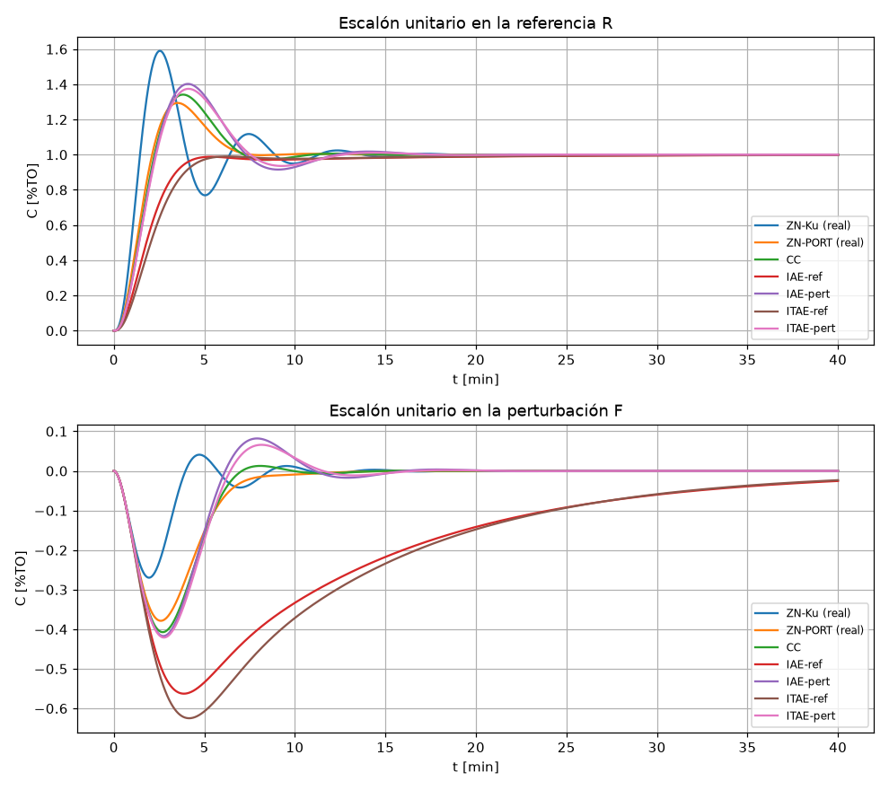

# CP-1: Ajuste de controladores (ZN, CC, CI), resuelto paso a paso

Ejemplo 6-1.1 de Smith & Corripio: control de temperatura en un calentador de tanque agitado.

**Archivos de esta carpeta**

| Archivo | Qué es |
|---|---|
| `cp1.m` | Script MATLAB completo: el entregable que pide la guía. |
| `cp1_calc.py` | Los mismos cálculos en Python (python-control). Con él se obtuvieron los números de este documento. |
| `cp1_pid_practico.py` | Simulación del PID práctico: saturación, filtro, derivada de la medición y anti-windup. |
| `comparacion.png` | Gráfica comparativa de los 7 controladores. |

> Los valores de abajo se calcularon con Python. En MATLAB deberían salir iguales o con diferencias en el tercer decimal: `t28` y `t63` dependen del paso de tiempo y `stepinfo` mide `ts` de otra forma.

---

## Paso 0: Entender el problema

- **Variable controlada:** temperatura del tanque $T$ (el transmisor la entrega como $C$, en %TO).
- **Variable manipulada:** la señal al actuador $M$ (%CO), que mueve la válvula de vapor $W$.
- **Perturbación:** el flujo de alimentación $F$.

A partir del diagrama de bloques reducido:

$$G_1(s)=G_v G_s H=\frac{1.652}{0.2s+1}\cdot\frac{1.183}{(8.34s+1)(0.502s+1)}\cdot\frac{1}{0.75s+1}$$

$$G_2(s)=G_F H=\frac{-3.34(0.524s+1)}{(8.34s+1)(0.502s+1)}\cdot\frac{1}{0.75s+1}$$

$$C(s)=\underbrace{\frac{G_cG_1}{1+G_cG_1}}_{\text{servo}}R(s)+\underbrace{\frac{G_2}{1+G_cG_1}}_{\text{regulación}}F(s)$$

**De dónde sale** (una ecuación por bloque, reemplazar y despejar; ver Resumen, sección 2.6):
- $M=G_c(R-C)$ (controlador), $W=G_vM$ (válvula), $T=G_sW+G_FF$ (tanque), $C=HT$ (transmisor).
- Reemplazando de adentro hacia afuera: $C=H\big(G_sG_vG_c(R-C)+G_FF\big)=G_1G_c(R-C)+G_2F$.
- Despejando: $C\,(1+G_cG_1)=G_cG_1R+G_2F$, que es la expresión de arriba.
- Regla rápida: cada FT es (camino directo desde esa entrada hasta $C$) / (1 + ganancia del lazo). Desde $R$ el camino es $G_cG_vG_sH=G_cG_1$; desde $F$ es $G_FH=G_2$. El **denominador es el mismo** para las dos entradas.
- Por eso en MATLAB: `feedback(Gc*G1,1)` para la referencia y `G2*feedback(1,Gc*G1)` para la perturbación ($=G_2/(1+G_cG_1)$).
- Error ante $F$ escalón: $C/F(0)=\dfrac{G_2(0)}{1+G_c(0)G_1(0)}$. Con integrador en $G_c$, $G_c(0)=\infty$ y vale 0.

**Observaciones previas:**
- La ganancia de $G_1$ es positiva ($1.652\cdot1.183=1.954$): el proceso es de **acción directa**. Por eso el controlador debe ser de **acción inversa** (la configuración normal $e=r-c$ con $K_c>0$), para que la realimentación sea negativa.
- La ganancia de $G_2$ es negativa: si entra más alimentación fría, la temperatura baja.
- La planta es **tipo 0**. Hace falta la acción **I en el controlador** para tener error cero ante un escalón, tanto en la referencia como en la perturbación (Conf. 1).

---

## Paso 1: Programar los modelos con `tf`

```matlab
Gv = tf(1.652, [0.2 1]);
Gs = tf(1.183, conv([8.34 1], [0.502 1]));
Gf = tf(-3.34*[0.524 1], conv([8.34 1], [0.502 1]));
H  = tf(1, [0.75 1]);
G1 = Gv*Gs*H;   G2 = Gf*H;
```

---

## Paso 2: $K_u$ y $T_u$ con `margin`

`margin(G1)` entrega el margen de ganancia $G_m$ y la frecuencia donde la fase vale −180° ($\omega_{cg}$). Si en lazo cerrado se usa un P con ganancia $K_c=G_m$, el sistema queda justo en el límite de estabilidad (oscila de forma sostenida). Por eso:

$$K_u = G_m \ (\text{en veces, no en dB}),\qquad T_u=\frac{2\pi}{\omega_u}$$

| Resultado | Valor |
|---|---|
| $K_u$ | **10.43** %CO/%TO |
| $\omega_u$ | 1.359 rad/min |
| $T_u$ | **4.62 min** |

---

## Paso 3: Modelo PORT con $t_{28}$ y $t_{63}$

Se aplica un escalón unitario a $G_1$ en lazo abierto, con `step(G1)`:

1. $K = y(\infty)=$ **1.953** (igual a $1.652\cdot1.183\cdot1$).
2. Se mide cuándo la salida llega al 28,3 % y al 63,2 % de $K$: $t_{28}=$ **4.26 min** y $t_{63}=$ **9.83 min**.
3. Se calculan $T$ y $L$:

$$T=\tfrac32(t_{63}-t_{28})=\tfrac32(9.831-4.263)=\mathbf{8.35\ min}$$
$$L=t_{63}-T=9.831-8.352=\mathbf{1.48\ min}$$
$$L/T=0.177$$

Entonces:

$$G_{PORT}(s)=\frac{1.953\,e^{-1.48s}}{8.35s+1}$$

$L/T=0.177$ cae dentro del rango de validez de ZN (0.1–0.5) y de los criterios integrales (0.1–1).

---

## Paso 4: Sintonías

Con $r=L/T=0.177$:

| # | Método | Fórmulas | $K_c$ | $T_i$ [min] | $T_d$ [min] | Forma |
|---|---|---|---|---|---|---|
| 1 | ZN con $K_u,T_u$ | $K_u/1.6,\ T_u/2,\ T_u/8$ | **6.516** | **2.312** | **0.578** | serie |
| 2 | ZN con PORT | $1.2\frac{T}{KL},\ 2L,\ 0.5L$ | **3.471** | **2.958** | **0.739** | serie |
| 3 | Cohen-Coon | $\frac{T}{KL}(\frac43+\frac r4),\ L\frac{32+6r}{13+8r},\ \frac{4L}{11+2r}$ | **3.984** | **3.392** | **0.521** | ideal |
| 4 | IAE referencia | $\frac{1.086}{K}r^{-0.869},\ \frac{T}{0.740-0.130r},\ 0.348Tr^{0.914}$ | **2.504** | **11.649** | **0.597** | ideal |
| 5 | IAE perturbación | $\frac{1.435}{K}r^{-0.921},\ \frac{T}{0.878}r^{0.749},\ 0.482Tr^{1.137}$ | **3.620** | **2.601** | **0.562** | ideal |
| 6 | ITAE referencia | $\frac{0.965}{K}r^{-0.855},\ \frac{T}{0.796-0.147r},\ 0.308Tr^{0.929}$ | **2.171** | **10.847** | **0.515** | ideal |
| 7 | ITAE perturbación | $\frac{1.357}{K}r^{-0.947},\ \frac{T}{0.842}r^{0.738},\ 0.381Tr^{0.995}$ | **3.581** | **2.765** | **0.568** | ideal |

Cómo se programa cada PID:

```matlab
pidReal  = @(p) p(1)*(1 + tf(1,[p(2) 0]))*tf([p(3) 1],1);        % serie ("real")
pidIdeal = @(p) p(1)*(1 + tf(1,[p(2) 0]) + tf([p(3) 0],1));      % ideal
Tr  = feedback(Gc*G1, 1);        % C/R: escalón en la referencia
Tdp = G2*feedback(1, Gc*G1);     % C/F: escalón en la perturbación
step(Tr, 40); step(Tdp, 40);
```

---

## Pasos 5 a 11: Desempeño de cada controlador

$M_p$ es el sobrepaso, $t_s$ el tiempo de asentamiento al 2 % e IAE la integral del error absoluto. En la perturbación, "pico" es la desviación máxima de $C$ ante $\Delta F=1$.

| Controlador | Forma | Ref: $M_p$ | Ref: $t_s$ | Ref: IAE | Pert: pico | Pert: $t_s$ | Pert: IAE |
|---|---|---|---|---|---|---|---|
| 1 ZN-$K_u$ | **real** ✔ | 59.0 % | 12.8 | 2.55 | −0.270 | 12.6 | **0.75** |
| 1 ZN-$K_u$ | ideal ✘ | 51.8 % | 9.9 | 2.31 | −0.289 | 9.7 | 0.84 |
| 2 ZN-PORT | **real** ✔ | 29.4 % | 6.7 | **2.05** | −0.379 | 10.7 | 1.46 |
| 2 ZN-PORT | ideal ✘ | 27.2 % | 12.4 | 2.43 | −0.408 | 13.0 | 1.78 |
| 3 CC | real ✘ | 36.6 % | 11.0 | 2.28 | −0.388 | 12.3 | 1.45 |
| 3 CC | **ideal** ✔ | 34.1 % | 9.5 | 2.37 | −0.407 | 9.0 | 1.50 |
| 4 IAE-ref | ideal | **0 %** | 12.4 | 2.36 | −0.563 | ≈ 49 | 7.95 |
| 5 IAE-pert | ideal | 40.2 % | 11.5 | 2.89 | −0.417 | 14.7 | 1.74 |
| 6 ITAE-ref | ideal | **0 %** | 11.5 | 2.54 | −0.625 | ≈ 47 | 8.54 |
| 7 ITAE-pert | ideal | 37.4 % | 11.6 | 2.76 | −0.421 | 14.5 | 1.73 |

✔ = la forma para la que el método fue diseñado. ✘ = los mismos números usados en la otra forma.



---

## Paso 12: Comparación y conclusiones

1. **ZN con $K_u$ es el más agresivo.** Tiene la mayor ganancia ($K_c=6.5$), por eso rechaza mejor la perturbación (pico −0.27, IAE 0.75). A cambio, ante la referencia sobrepasa un 59 % y oscila. Es la conducta típica de ¼ RD en lazo cerrado: sirve para regulación, pero es mala para seguimiento.
2. **ZN con PORT y CC dan un término medio** (sobrepaso de 29–37 %, pico ante perturbación ≈ −0.38 a −0.41). Salen más conservadores que ZN-$K_u$ porque parten del modelo PORT aproximado, cuyo retardo $L$ agrupa todas las constantes de tiempo pequeñas. CC queda un poco más agresivo que ZN-PORT, lo esperable con $L/T$ pequeño.
3. **Los criterios para la referencia (IAE-ref, ITAE-ref) no tienen sobrepaso** y siguen muy bien la referencia. Pero tienen un $T_i$ grande (≈ 11 min, del orden de $T$), así que su acción integral es lenta: ante la perturbación la desviación es mayor (−0.56 a −0.63) y tarda casi **50 min** en eliminarse (IAE ≈ 8, unas 5 veces más que los otros).
4. **Los criterios para la perturbación (IAE-pert, ITAE-pert)** tienen un $T_i$ pequeño (≈ 2.6–2.8 min). Rechazan la perturbación en ≈ 15 min, pero sobrepasan ≈ 40 % ante la referencia.
5. **Conclusión central:** el ajuste óptimo **depende de la entrada para la que se sintoniza** (Conf. 2). En este calentador la perturbación típica es el flujo de alimentación $F$, así que conviene un ajuste para **perturbación** (ITAE-pert o CC). Si también importa el seguimiento sin sobrepaso, se puede usar un prefiltro o ponderar la referencia (PID 2DOF).
6. **Forma serie vs. ideal:** usar los parámetros en la forma equivocada cambia la respuesta. ZN está hecho para el PID serie: en ideal, su $K_c$ efectivo baja (8.14 → 6.52), igual que su $T_i$ efectivo (2.89 → 2.31), y la respuesta cambia. CC y los criterios integrales están hechos para el ideal. La diferencia es moderada porque $T_d \ll T_i$.

---

## Paso 13: ZN (1er controlador) serie → ideal → paralelo

Parámetros serie: $K'_c=6.516$, $T'_i=2.312$, $T'_d=0.578$.

$$K_c=K'_c\Big(1+\frac{T'_d}{T'_i}\Big)=6.516\,(1+0.25)=\mathbf{8.145}$$
$$T_i=T'_i+T'_d=\mathbf{2.890\ min}\qquad T_d=\frac{T'_iT'_d}{T'_i+T'_d}=\mathbf{0.462\ min}$$

Forma paralela $P+\dfrac{I}{s}+Ds$:

$$P=K_c=\mathbf{8.145}\qquad I=\frac{K_c}{T_i}=\mathbf{2.818}\qquad D=K_cT_d=\mathbf{3.766}$$

Parámetros del PID práctico:
- Anti-windup (PID): $K_b=1/\sqrt{T_iT_d}=\mathbf{0.865}$.
- Filtro derivativo: $N=20$ rad/min. Se eligió $N\approx 10/T_d$, así el filtro corta a ≈ 3 Hz/min, muy por encima de $\omega_u=1.36$ rad/min.
- Saturación del mando: ±3.

---

## Paso 14: Armar el sistema en Simulink

### Opción A: bloque *PID Controller (2DOF)* (la más rápida)
Configuración del bloque:
- **Form:** Parallel; P = 8.145, I = 2.818, D = 3.766.
- **Filter coefficient N:** 20.
- **Setpoint weights:** b = 1, **c = 0**. Con c = 0 la acción D solo ve $-C$, es decir, **deriva la medición**.
- Pestaña *Output Saturation*: activar *Limit output*, Upper = 3, Lower = −3.
- **Anti-windup method:** back-calculation, **Kb = 0.865**.

### Opción B: con bloques sueltos (sirve para "ver" cada modificación)

```
 Step(R) ─►(+)─ e ─┬─► [Gain P] ─────────────────────────┐
           ▲−      │                                      ▼
           │       └─► [Gain I] ─►(+)─► [1/s] ─ ui ────►(+)─ u ─► [Saturation ±3] ─ us ─┬─► [Gv] ─► [Gs] ─►(+)─ T ─┬─► [H] ─┐
           │                      ▲+                      ▲+                              │               ▲+          │        │
           │                      │                       │                               │      Step(F) ─► [Gf]      Scope    │
           │                  [Gain Kb] ◄──(−)(+)◄────────┼── u  y  us ◄──────────────────┘                                    │
           │                                              │                                                                    │
           │              −C ─► [ D·N·s/(s+N) ] ─ ud ─────┘                                                                    │
           └───────────────────────────────────────────── C ◄───────────────────────────────────────────────────────────────────┘
```

1. **Planta:** bloques *Transfer Fcn* para $G_v$, $G_s$, $G_f$ y $H$. $G_v\cdot G_s$ y $G_f$ se suman en $T$, y $H$ da $C$.
2. **Error:** *Sum* (+ −) entre R y C.
3. **P:** *Gain* = 8.145 sobre $e$.
4. **I con anti-windup:** $e$ → *Gain* I = 2.818 → *Sum* (+ +) → *Integrator* → $u_i$. A la segunda entrada del Sum llega $K_b(u_s-u)$: un *Sum* (+ −) entre la salida y la entrada de la saturación, y luego una *Gain* $K_b$ = 0.865.
5. **D sobre la medición con filtro:** *Transfer Fcn* con num = `[D*N 0]` y den = `[1 N]` (es decir, $\frac{Ds}{s/N+1}$), aplicado a **−C** y no a $e$.
6. $u=u_p+u_i+u_d$ → *Saturation* (±3) → entrada de $G_v$.
7. Escalón en R en t = 1 min. Escalón en F en t = 1 min (o más tarde, para ver ambos en la misma simulación). *Scope* en C y en $u_s$.

Evalúe las modificaciones **agregándolas de a una**, como en la tabla siguiente.

---

## Paso 15: Efecto de cada modificación

Resultados de `cp1_pid_practico.py` (PID paralelo equivalente a ZN-$K_u$, escalones unitarios en t = 1 min):

| Caso | Ref: $M_p$ | Ref: $t_s$ | Ref: IAE | $\lvert u\rvert_{max}$ | Pert: pico | Pert: IAE |
|---|---|---|---|---|---|---|
| 1. Lineal, D sobre el error (sin filtro, N = 1000) | 59.2 % | 12.8 | 2.56 | **3774** | −0.270 | 0.75 |
| 2. + saturación ±3 | **68.4 %** | 12.8 | **3.92** | 3 | −0.270 | 0.75 |
| 3. + filtro en la derivada (N = 20) | 68.1 % | 12.7 | 3.90 | 3 | −0.273 | 0.76 |
| 4. + derivada de la medición | 68.1 % | 12.7 | 3.90 | 3 | −0.273 | 0.76 |
| 5. + anti-windup (back-calc, $K_b$ = 0.865) | **18.7 %** | **11.4** | **2.52** | 3 | −0.273 | 0.75 |

**Interpretación:**
- **Caso 1:** con D sobre el error y sin filtro, un escalón en la referencia produce un "pico" de mando enorme (≈ 3800). Físicamente es imposible, y el caso 1 coincide con el lineal del Paso 5 (sobrepaso ≈ 59 %), lo que confirma que la conversión serie → paralelo está bien hecha.
- **Saturación sin anti-windup (caso 2):** la integral sigue acumulando mientras el actuador está en su límite (windup). El sobrepaso sube de 59 % a **68 %** y el IAE de 2.56 a 3.92.
- **Filtro (caso 3):** limita la ganancia de alta frecuencia de la acción D (amplifica el ruido como máximo $D\cdot N = 75$ veces, en vez de infinito). Casi no cambia la respuesta, porque N = 20 está muy por encima del ancho de banda del lazo.
- **Derivada de la medición (caso 4):** elimina el *derivative kick*. Sin saturación, el máximo de $u$ ante el escalón de referencia baja de **83.5 a 8.8**. Con saturación el efecto no se ve en C, porque el actuador satura igual por la acción P ($8.1\times1$), pero el mando es mucho menos brusco. Ante la perturbación no cambia nada, porque ahí la referencia es constante y derivar $e$ o $-C$ es lo mismo.
- **Anti-windup (caso 5):** es la mejora más importante. El sobrepaso baja de 68 % a **18.7 %** e incluso mejora el caso lineal ideal. Además $t_s$ baja a 11.4 min y el IAE a 2.52.
- **Ante la perturbación** ($\Delta F = 1$), el mando necesario se mantiene casi siempre dentro de ±3. Por eso la saturación y el anti-windup casi no afectan la regulación.

**Conclusión:** un PID "de libro" no se puede implementar tal cual. La **saturación** del actuador es inevitable y, sin **anti-windup**, empeora mucho la respuesta. El **filtro** y la **derivada de la medición** hacen implementable la acción D (acotan el ruido y el *kick*) sin perder desempeño.
