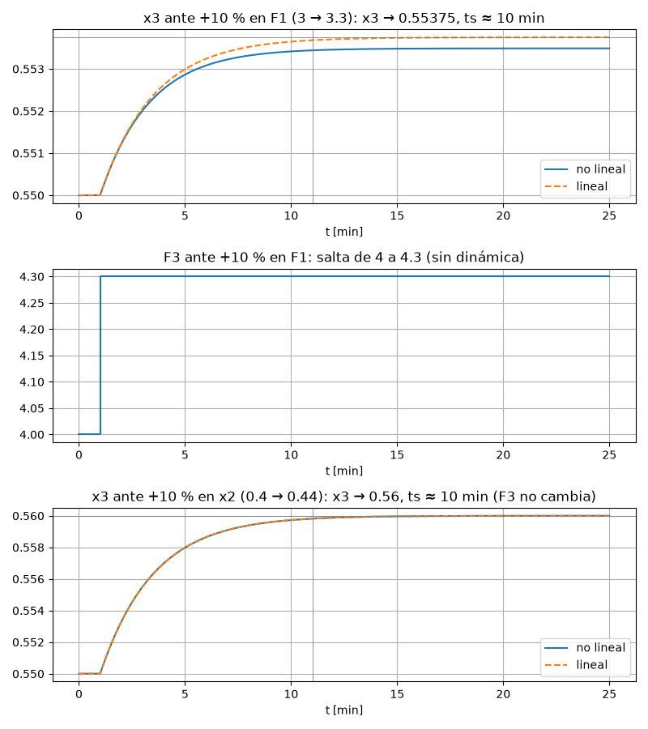
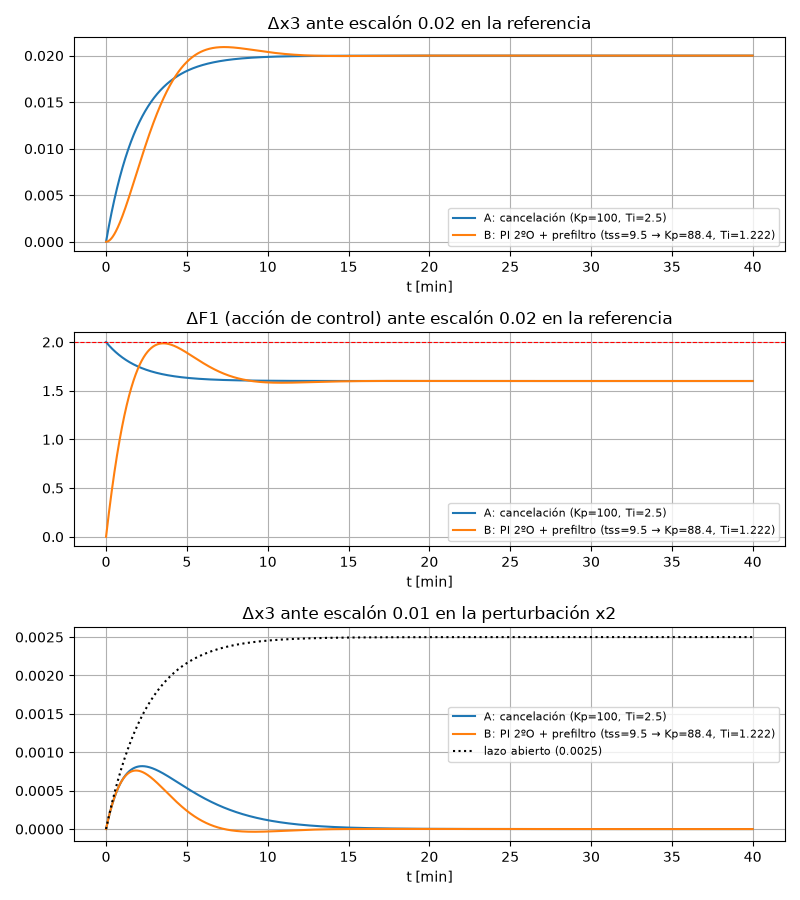

# CP-2: Control para plantas de primer orden, resuelto paso a paso

**Archivos de esta carpeta**

| Archivo | Qué es |
|---|---|
| `cp2.m` | Script MATLAB: modelo, respuestas 1g y los dos diseños del ejercicio 2. |
| `cp2_calc.py` | Verificación en Python del ejercicio 2, con barridos de diseño. |
| `cp2_plots.py` | Genera las gráficas. Además valida la linealización contra el modelo **no lineal**. |
| `p1g_respuestas.png` | Gráficas de la parte 1g. |
| `p2_control.png` | Gráficas de la parte 2b. |

> Los números se calcularon en Python (python-control). En MATLAB deberían salir iguales.

---

# Ejercicio 1: Modelo del mezclador

**Datos**
- Constantes: $x_1=0.6$, $F_2=1$ cm³/min, $\rho=100$ g/cm³, $V=10$ cm³.
- Punto de operación conocido: $x_{2o}=0.4$, $F_{1o}=3$ cm³/min.
- Hay una válvula en $F_1$. $x_2$ lo impone el proceso anterior.
- Se quiere controlar, en orden de prioridad, $x_3$ y $F_3$.

## a) Ecuaciones en el tiempo

Como $\rho$ y $V$ son **constantes**, $\dfrac{d(\rho V)}{dt}=0$ y $\rho$ se simplifica en todo:

**Balance total** (queda algebraico, sin dinámica):
$$F_1(t)+F_2-F_3(t)=0\ \Rightarrow\ \boxed{F_3(t)=F_1(t)+1}$$

**Balance parcial** (con $V$ constante, $\frac{d(x_3V)}{dt}=V\frac{dx_3}{dt}$):
$$x_1F_1(t)+x_2(t)F_2-x_3(t)F_3(t)=V\frac{dx_3(t)}{dt}$$
$$\boxed{10\,\frac{dx_3(t)}{dt}=0.6\,F_1(t)+x_2(t)-x_3(t)F_3(t)}$$

## b) Variables, objetivos y grados de libertad

| Variable | Tipo |
|---|---|
| $F_1(t)$ | **Entrada manipulable** (tiene válvula) |
| $x_2(t)$ | **Entrada perturbadora** (la fija el proceso anterior) |
| $x_3(t)$ | **Salida** (1ª prioridad de control) |
| $F_3(t)$ | **Salida** (2ª prioridad) |
| $x_1, F_2, \rho, V$ | Parámetros constantes |

**Objetivos posibles:** controlar la composición $x_3$ y controlar el caudal de producto $F_3$.

**Análisis de grados de libertad:**
- Variables: 4 ($F_1, x_2, x_3, F_3$). Ecuaciones: 2. Entonces $GDL=4-2=2$.
- Una de esas variables la fija el entorno (la perturbación $x_2$). Queda **$GDL_{control}=1$**, que es $F_1$.

**Interpretación:** con una sola manipulable **solo se puede controlar una salida**. Además $F_3=F_1+1$: si se fija $F_1$ para controlar $x_3$, $F_3$ queda determinado automáticamente, y viceversa. No se pueden llevar ambas a valores arbitrarios. Por la prioridad se controla **$x_3$ con $F_1$**, y $F_3$ queda libre, "a lo que resulte". Para controlar ambas haría falta otra manipulable, por ejemplo una válvula en $F_2$ o en $F_3$ con volumen variable.

## c) Punto de operación completo

- Balance total: $F_{3o}=F_{1o}+F_2=3+1=\mathbf{4\ cm^3/min}$.
- Balance parcial en estado estable ($dx_3/dt=0$):

$$x_{3o}=\frac{x_1F_{1o}+x_{2o}F_2}{F_{3o}}=\frac{0.6\cdot3+0.4\cdot1}{4}=\frac{2.2}{4}=\mathbf{0.55}$$

## d) Primera ecuación en variables de desviación

Se define $\Delta F_1 = F_1-F_{1o}$, y análogo para las demás. Restando el estado estable:
$$\Delta F_3(t)=\Delta F_1(t)\quad\xrightarrow{\ \mathcal L\ }\quad \boxed{F_3(s)=F_1(s)}$$
(Ganancia 1 y sin dinámica: $F_3$ sigue a $F_1$ instantáneamente.)

## e) No linealidad de la segunda ecuación, Taylor y Laplace

La no linealidad es el **producto** $x_3(t)F_3(t)$, o bien $x_3F_1$ si se sustituye $F_3=F_1+1$. Por Taylor, alrededor del punto de operación:
$$x_3F_3\approx x_{3o}F_{3o}+F_{3o}\,\Delta x_3+x_{3o}\,\Delta F_3=x_{3o}F_{3o}+4\,\Delta x_3+0.55\,\Delta F_1$$

Se sustituye y se resta el estado estable ($0.6F_{1o}+x_{2o}-x_{3o}F_{3o}=0$):
$$10\frac{d\Delta x_3}{dt}=0.6\Delta F_1+\Delta x_2-4\Delta x_3-0.55\Delta F_1$$
$$10\frac{d\Delta x_3}{dt}+4\Delta x_3=0.05\,\Delta F_1+1\cdot\Delta x_2$$

Laplace, con condiciones iniciales nulas porque son desviaciones:
$$\boxed{X_3(s)=\frac{0.05}{10s+4}F_1(s)+\frac{1}{10s+4}X_2(s)=\frac{0.0125}{2.5s+1}F_1(s)+\frac{0.25}{2.5s+1}X_2(s)}$$

Coincide con la planta del ejercicio 2. En resumen:
- La constante de tiempo es $\tau=V/F_{3o}=2.5$ min (el tiempo de residencia).
- Las ganancias son $K_{F1}=(x_1-x_{3o})/F_{3o}=0.0125$ y $K_{x2}=F_2/F_{3o}=0.25$.

## f) Diagrama de bloques

```
 Perturbación   x2(s) ──► [ 1/(10s+4) ] ──────────┐
                                                  ▼ +
 Manipulable    F1(s) ─┬─► [ 0.05/(10s+4) ] ──►( Σ )──► x3(s)   (salida 1, prioridad)
                       │                         +
                       └─► [ 1 ] ───────────────────────► F3(s)   (salida 2)
```

## g) Respuesta a escalones del 10 %

| Entrada (escalón) | Salida | Valor final | $t_s$ (2 %) |
|---|---|---|---|
| $F_1$: 3 → 3.3 ($\Delta=0.3$) | $x_3$ | $0.55+0.0125\cdot0.3=\mathbf{0.55375}$ | $4\tau=\mathbf{10\ min}$ |
| $F_1$: 3 → 3.3 | $F_3$ | 4 → **4.3** | **0** (inmediato) |
| $x_2$: 0.4 → 0.44 ($\Delta=0.04$) | $x_3$ | $0.55+0.25\cdot0.04=\mathbf{0.56}$ | **10 min** |
| $x_2$: 0.4 → 0.44 | $F_3$ | **no cambia** (4) | — |



**Comprobación con el modelo no lineal:** simulando las ecuaciones originales, $x_3$ tiende a **0.55349** ante el escalón en $F_1$ (el lineal da 0.55375) y a **0.56000** ante el escalón en $x_2$ (exacto, porque $x_2$ entra linealmente). La pequeña diferencia en $F_1$ es el error de la linealización. En el no lineal, además, $\tau=V/F_3=10/4.3=2.33$ min.

**Observación importante para el ejercicio 2:** la ganancia de $F_1$ sobre $x_3$ es **muy pequeña** (0.0125). Mover $x_3$ requiere cambios grandes en $F_1$. Por eso la saturación del mando va a limitar el diseño.

---

# Ejercicio 2: Control de la planta de 1er orden

$$G_p(s)=\frac{0.05}{10s+4}=\frac{0.0125}{2.5s+1}\ (K=0.0125,\ T=2.5)\qquad G_d(s)=\frac{1}{10s+4}=\frac{0.25}{2.5s+1}$$

## a) Diseño

**1. ¿Qué controlador?** La planta es **tipo 0**. Para tener error cero en estado estable ante un escalón (en la referencia, y de paso en la perturbación) hace falta **acción integral en el controlador**. Se usa un **PI**:
$$G_c(s)=K_p\frac{T_is+1}{T_is}$$

**2. Restricción de saturación.** En estado estable, para subir $x_3$ en 0.02 hace falta:
$$\Delta F_{1,ss}=\frac{0.02}{K}=\frac{0.02}{0.0125}=\mathbf{1.6}\ (<2\ \checkmark)$$
Hay margen, pero es poco (1.6 de 2). **El transitorio del mando no puede pasar de 2**, y eso fija la máxima rapidez alcanzable.

### Diseño A: PI por cancelación (el método de la clase)
- Cancelación del polo de la planta: $T_i=T=\mathbf{2.5}$ min.
- Lazo cerrado de 1er orden: $G_{LC}=\dfrac{1}{T_{LC}s+1}$, con $T_{LC}=\dfrac{T}{K_pK}$.
- La acción de control es
$$\frac{U}{R}=\frac{G_c}{1+G_cG}=K_p\frac{Ts+1}{Ts+K_pK}$$
  En $t=0^+$ vale $u=K_p\cdot0.02$ (el salto proporcional) y después **decrece monótonamente** hasta 1.6. El máximo está en $t=0^+$.
- Condición de no saturar: $K_p\cdot0.02\le2\ \Rightarrow\ \boxed{K_p\le100}$.
- Se toma la mayor ganancia posible (Conf. 3: "la ganancia debe ser lo mayor posible mientras no se sature"): **$K_p=100$, $T_i=2.5$**.
- Resultado: $T_{LC}=\dfrac{2.5}{100\cdot0.0125}=\mathbf{2\ min}$, así que $t_s\approx4T_{LC}=\mathbf{8\ min}$ (en lazo abierto eran 10 min).

$$\boxed{G_c(s)=100\,\frac{2.5s+1}{2.5s}=100+\frac{40}{s}}$$

> En la práctica conviene dejar algo de margen, por ejemplo $K_p=90$ ($u_{max}=1.8$), porque con $K_p=100$ el mando llega exactamente a 2.

### Diseño B (alternativo): PI con 2º orden deseado y prefiltro
Con $\zeta=0.7$ ($M_p\approx4\%$):
$$\omega_n=\frac{4}{\zeta t_{ss}},\qquad K_p=\frac{2\zeta\omega_nT-1}{K},\qquad T_i=\frac{K_pK}{T\omega_n^2}$$

Barrido de $t_{ss}$ para ver cuál es el más rápido que **no satura**:

| $t_{ss}$ deseado | $K_p$ | $T_i$ | $u_{max}$ sin prefiltro | $u_{max}$ con prefiltro |
|---|---|---|---|---|
| 5 | 240 | 0.919 | 4.80 ✘ | 2.82 ✘ |
| 6 | 186.7 | 1.029 | 3.74 ✘ | 2.50 ✘ |
| 8 | 120 | 1.176 | 2.61 ✘ | 2.14 ✘ |
| **9.5** | **88.4** | **1.222** | 2.22 ✘ | **1.99 ✔** |
| 10 | 80 | 1.225 | 2.14 ✘ | 1.95 ✔ |

El mínimo que no satura (con prefiltro) es $t_{ss}\approx9.34$ min. Se toma **$t_{ss}=9.5$**: $K_p=88.4$, $T_i=1.222$ y prefiltro $\dfrac{1}{1.222s+1}$. Es coherente con la regla de la clase: $t_{ss}=9.5<5T=12.5$, así que corresponde usar prefiltro.

## b) Implementación en Simulink y desempeño

**Montaje en Simulink (diseño A):**
1. *Step* "Referencia": final value = 0.02 (t = 1).
2. *Sum* (+ −) → *PID Controller* (Form: Parallel, P = 100, I = 40, D = 0). Alternativa: *Transfer Fcn* con num `100*[2.5 1]` y den `[2.5 0]`.
3. *Saturation* ±2 → *Transfer Fcn* `0.05/(10s+4)` → *Sum* (+ +) → **x3** → realimentación al Sum del error.
4. *Step* "Perturbación": final value = 0.01 → *Transfer Fcn* `1/(10s+4)` → segunda entrada del Sum de salida. Conviene aplicarla más tarde, por ejemplo en t = 30, para ver ambos efectos en una misma corrida.
5. *Scope* en x3 y en la salida del controlador (para verificar que $|u|\le2$).
6. Diseño B: igual, pero con P = 88.4, I = 88.4/1.222 = 72.3, y un *Transfer Fcn* `1/(1.222s+1)` (prefiltro) entre el Step de referencia y el Sum.

**Resultados** (referencia 0.02 y perturbación 0.01, cada una por separado):

| | Ref: $t_s$ | Ref: $M_p$ | $u_{max}$ | Pert: pico $\Delta x_3$ | Pert: $t_s$ | Pert: IAE |
|---|---|---|---|---|---|---|
| Lazo abierto | 10 min | — | — | 0.0025 (**nunca se corrige**) | — | — |
| **A: cancelación** | **7.8 min** | 0 % | 2.00 | 0.00082 | 15.4 min | 0.0050 |
| **B: 2º orden + prefiltro** | 9.9 min | 4.6 % | 1.99 | **0.00076** | **11.8 min** | **0.0030** |



### Funciones de transferencia de lazo cerrado (cómo se obtienen)

Aquí la perturbación $x_2$ **no** entra a la entrada de la planta, sino por su propio camino $G_d$ que se suma en la salida:
```
          E       F1              X2 ─► Gd ─┐
 R ─►(+)─► Gc ─► [sat] ─► G ─────────────►(+)─┬─► X3
      ▲-                                       │
      └────────────────────────────────────────┘
```
Ecuaciones: $E=R-X_3$, $F_1=G_cE$, $X_3=G\,F_1+G_d\,X_2$. Reemplazando:
$$X_3=GG_c(R-X_3)+G_dX_2\ \Rightarrow\ X_3\,(1+G_cG)=G_cG\,R+G_d\,X_2$$
$$\frac{X_3}{R}=\frac{G_cG}{1+G_cG},\qquad \frac{X_3}{X_2}=\frac{G_d}{1+G_cG},\qquad \frac{F_1}{R}=\frac{G_c}{1+G_cG}$$
(Regla: camino directo desde la entrada / (1 + ganancia del lazo). Desde $X_2$ el camino directo es $G_d$.)

**Diseño A** ($G_c=100\frac{2.5s+1}{2.5s}$, $G=\frac{0.0125}{2.5s+1}$, $G_d=\frac{0.25}{2.5s+1}$):
1. Lazo: $G_cG=100\dfrac{2.5s+1}{2.5s}\cdot\dfrac{0.0125}{2.5s+1}=\dfrac{1.25}{2.5s}=\dfrac{0.5}{s}$ (se cancela el $(2.5s+1)$).
2. Referencia: $\dfrac{X_3}{R}=\dfrac{0.5/s}{1+0.5/s}=\dfrac{0.5}{s+0.5}=\dfrac{1}{2s+1}$ → $T_{LC}=2$, $t_s\approx8$ min.
3. Perturbación: $\dfrac{X_3}{X_2}=\dfrac{0.25}{2.5s+1}\cdot\dfrac{s}{s+0.5}=\dfrac{0.25\,s}{(2.5s+1)(s+0.5)}=\dfrac{0.5\,s}{(2.5s+1)(2s+1)}$.
   Aparece el **polo lento de la planta** ($\tau=2.5$), porque $G_d$ tiene el mismo polo y ahí no pasa por el controlador: no hay cancelación.
4. Mando: $\dfrac{F_1}{R}=\dfrac{G_c}{1+G_cG}=100\dfrac{2.5s+1}{2.5s}\cdot\dfrac{s}{s+0.5}=\dfrac{40\,(2.5s+1)}{s+0.5}$. En $t=0^+$ (teorema del valor inicial, $s\to\infty$) vale $100$ por unidad de referencia → $100\cdot0.02=2$; en estado estable ($s=0$) vale $80$ → $80\cdot0.02=1.6$. Son los valores de la sección a).

**Diseño B** ($K_p=88.42$, $T_i=1.222$), sin cancelación. Se usa $d_cd_p+n_cn_p$ (numeradores y denominadores del controlador y la planta):
1. Ecuación característica: $T_is(2.5s+1)+K_p\cdot0.0125\,(T_is+1)=0$. Dividiendo por $2.5T_i$:
   $$s^2+\frac{1+0.0125K_p}{2.5}s+\frac{0.0125K_p}{2.5T_i}=s^2+0.842s+0.362$$
   ($2\zeta\omega_n=0.842$, $\omega_n^2=0.362$ → $\omega_n=0.602$, $\zeta=0.7$ ✔).
2. Referencia sin prefiltro: $\dfrac{X_3}{R}=\dfrac{0.362\,(1.222s+1)}{s^2+0.842s+0.362}=\dfrac{0.442s+0.362}{s^2+0.842s+0.362}$.
   Con prefiltro $\frac{1}{1.222s+1}$ se cancela el cero: $\dfrac{0.362}{s^2+0.842s+0.362}$.
3. Perturbación: numerador $=0.25\cdot d_c=0.25\,T_is$, dividido por $2.5T_i$:
   $$\frac{X_3}{X_2}=\frac{0.1\,s}{s^2+0.842s+0.362}$$
   Tiene los **mismos polos** que ante la referencia (el prefiltro no afecta este camino).

**Lectura:** en ambos diseños la $s$ del numerador de $X_3/X_2$ viene del integrador del PI, así que $X_3/X_2(0)=0$ y la perturbación escalón no deja error. La diferencia está en los polos: A tiene el polo lento $\tau=2.5$ ante la perturbación; B tiene los polos de diseño ($\zeta\omega_n=0.42$, $t_s\approx9.5$ min).

## Conclusiones

1. El PI da **error cero** ante escalón en la referencia y en la perturbación. En lazo abierto, la perturbación de 0.01 dejaría un error permanente de 0.0025.
2. La **saturación del mando** (±2) limita la rapidez. Como la ganancia del proceso es muy baja (0.0125) y el mando necesario en estado estable ya es 1.6, casi no hay margen para acelerar el lazo.
3. **Cancelación:** es simple, sigue la referencia sin sobrepaso y es la más rápida ante la referencia (8 min). Pero ante la perturbación es **más lenta** (15 min), porque reaparece el polo de la planta. Además depende de conocer bien $T$.
4. **2º orden con prefiltro:** con el mismo límite de mando, es algo más lento ante la referencia, pero **rechaza mejor la perturbación** (IAE 40 % menor, $t_s$ 12 vs. 15 min), porque sus polos son los mismos para ambas entradas. Es la misma conclusión de la Conf. 3.
