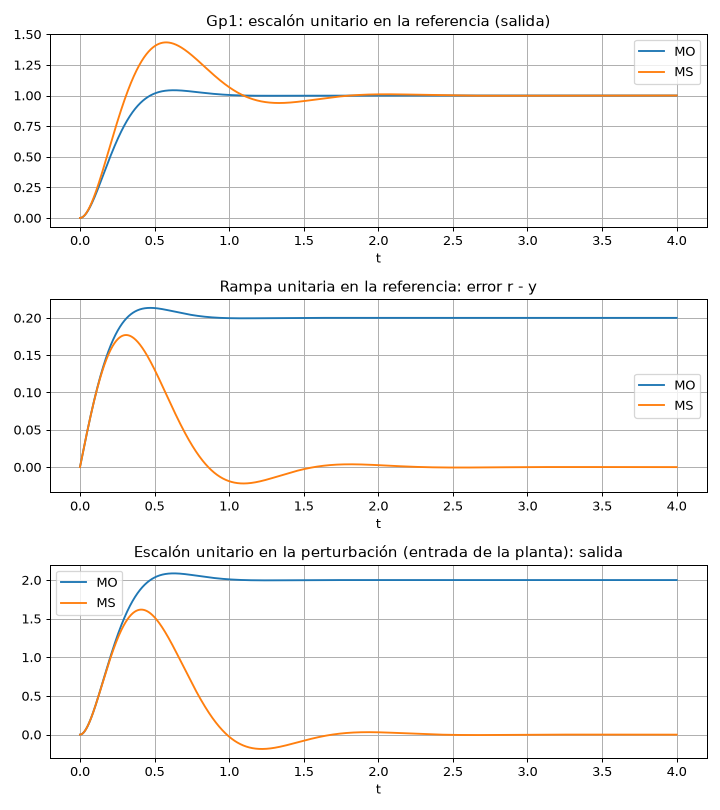
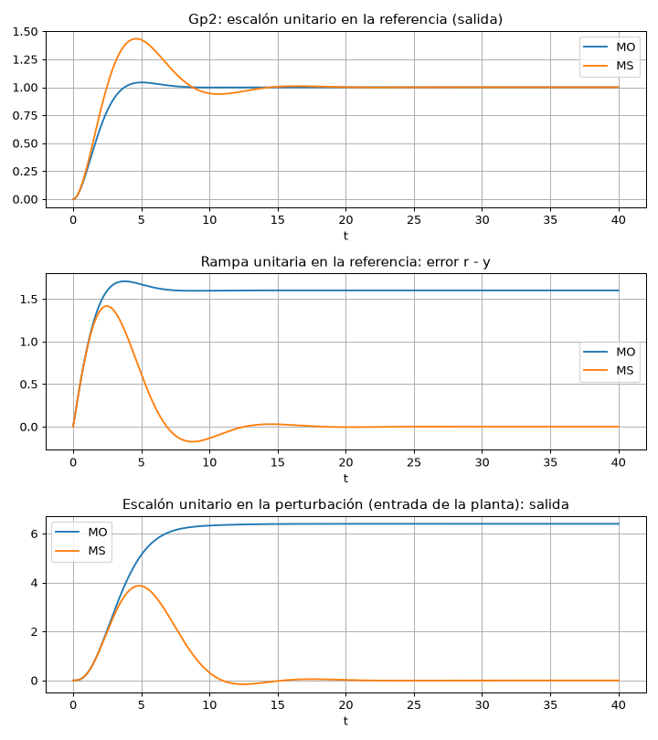
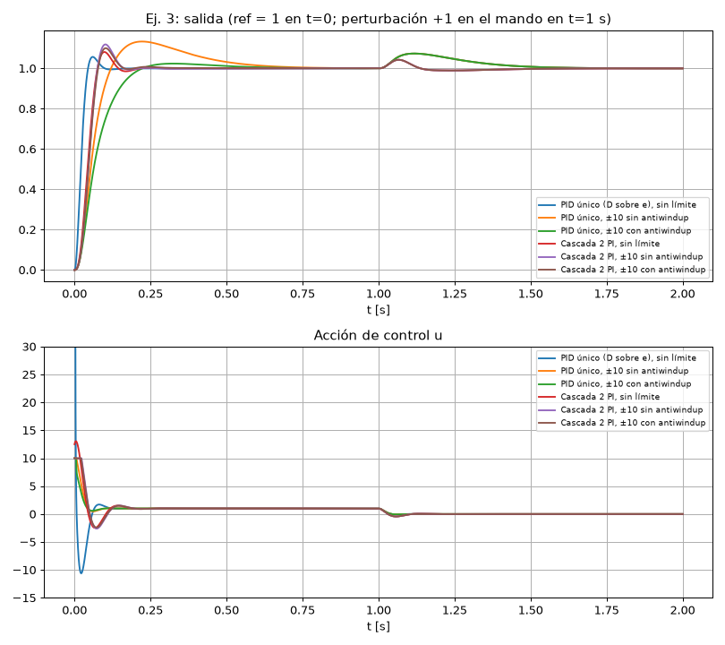
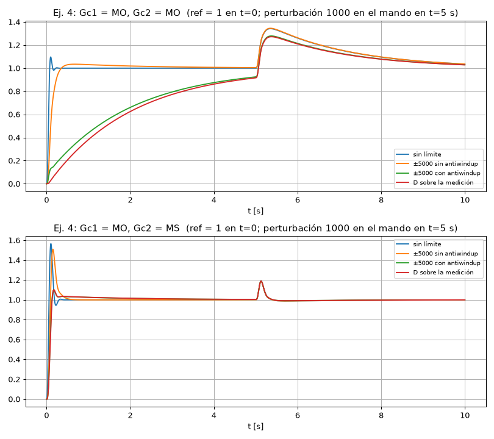

# CP-3: Compensación serie (módulo óptimo y módulo simétrico), resuelto paso a paso

**Archivos de esta carpeta**

| Archivo | Qué es |
|---|---|
| `cp3.m` | Script MATLAB: ejercicio 1 simbólico y ejercicios 2, 3 y 4 lineales. |
| `cp3_ej12.py` | Verificación en Python de los ejercicios 1 (sympy) y 2. |
| `cp3_sim.py` | Simulación **no lineal** de los ejercicios 3 y 4, con el PID del diagrama de la guía: saturación, anti-windup, D sobre el error o sobre la medición y perturbación en el mando. |
| `cp3_plots.py` | Genera todas las gráficas. |
| `ej2_Gp1.png`, `ej2_Gp2.png`, `ej3.png`, `ej4.png` | Gráficas. |

> Todo se calculó y simuló en Python. En MATLAB/Simulink deberían salir los mismos resultados.

**Fórmulas de síntesis** (con $K_r=1$ y $T_u$ = la menor constante de tiempo, que **no** se compensa):

$$G_c^{MO}=\frac{1}{2T_us(T_us+1)\,G_p}\qquad\qquad G_c^{MS}=\frac{4T_us+1}{8T_u^2s^2(T_us+1)\,G_p}$$

Lazo abierto resultante:
- **MO:** $\dfrac{1}{2T_us(T_us+1)}$. Es tipo 1, con $\zeta=0.707$, $M_p\approx4\%$ y margen de fase ≈ 65°.
- **MS:** $\dfrac{4T_us+1}{8T_u^2s^2(T_us+1)}$. Es tipo 2, con $M_p\approx43\%$ y margen de fase ≈ 37°.

---

## Ejercicio 1: Síntesis general ($T_1$ = menor constante, $K=\prod K_i$)

Procedimiento en cada caso: se sustituye $G_p$ en la fórmula, se cancela lo que se pueda y se desarrolla en $K_p+K_i/s+K_d s$.

### Planta a) $\;G_p=\dfrac{K_1K_2}{s(T_1s+1)}$ (tipo 1)
- **MO:** $G_c=\dfrac{1}{2T_1K}$ → **P**, con $K_p=\dfrac{1}{2T_1K}$.
- **MS:** $G_c=\dfrac{4T_1s+1}{8T_1^2Ks}$ → **PI**, con $K_p=\dfrac{1}{2T_1K}$ y $K_i=\dfrac{1}{8T_1^2K}$.

### Planta b) $\;G_p=\dfrac{K_1K_2}{(T_1s+1)(T_2s+1)}$ (tipo 0)
- **MO:** $G_c=\dfrac{T_2s+1}{2T_1Ks}$ → **PI**, con $K_p=\dfrac{T_2}{2T_1K}$ y $K_i=\dfrac{1}{2T_1K}$.
- **MS:** $G_c=\dfrac{(4T_1s+1)(T_2s+1)}{8T_1^2Ks^2}=\underbrace{\dfrac{T_2}{2T_1K}}_{K_p}+\underbrace{\dfrac{4T_1+T_2}{8T_1^2K}}_{K_i}\dfrac1s+\underbrace{\dfrac{1}{8T_1^2K}}_{K_{ii}}\dfrac{1}{s^2}$
  → **PI con doble integrador** (PI·I). No entra en la forma $K_p+K_i/s+K_ds$. Por eso la guía dice que el MS en plantas tipo 0 conviene reemplazarlo por mando subordinado.

### Planta c) $\;G_p=\dfrac{K_1K_2K_3}{s(T_1s+1)(T_2s+1)}$ (tipo 1)
- **MO:** $G_c=\dfrac{T_2s+1}{2T_1K}$ → **PD**, con $K_p=\dfrac{1}{2T_1K}$ y $K_d=\dfrac{T_2}{2T_1K}$.
- **MS:** $G_c=\dfrac{(4T_1s+1)(T_2s+1)}{8T_1^2Ks}$ → **PID**, con $K_p=\dfrac{4T_1+T_2}{8T_1^2K}$, $K_i=\dfrac{1}{8T_1^2K}$ y $K_d=\dfrac{T_2}{2T_1K}$.

### Planta d) $\;G_p=\dfrac{K_1K_2K_3}{(T_1s+1)(T_2s+1)(T_3s+1)}$ (tipo 0)
- **MO:** $G_c=\dfrac{(T_2s+1)(T_3s+1)}{2T_1Ks}$ → **PID**, con $K_p=\dfrac{T_2+T_3}{2T_1K}$, $K_i=\dfrac{1}{2T_1K}$ y $K_d=\dfrac{T_2T_3}{2T_1K}$.
- **MS:** $G_c=\dfrac{(4T_1s+1)(T_2s+1)(T_3s+1)}{8T_1^2Ks^2}$
  $=\dfrac{T_2+T_3}{2T_1K}+\dfrac{T_2T_3}{8T_1^2K}+\left(\dfrac{1}{2T_1K}+\dfrac{T_2+T_3}{8T_1^2K}\right)\dfrac1s+\dfrac{1}{8T_1^2K}\dfrac1{s^2}+\dfrac{T_2T_3}{2T_1K}s$
  → **PID con doble integrador** (PIID).

**Regla que resume todo:**
- **MO:** cada constante lenta compensada aporta un **cero** (una acción D o un PI). Si la planta **no** tiene integrador, el controlador lo pone.
- **MS:** necesita **dos** integradores en el lazo. Si la planta ya tiene uno, el controlador pone el otro (PI o PID). Si no tiene ninguno, el controlador necesita $1/s^2$.

---

## Ejercicio 2

### $G_{p1}=\dfrac{100}{s(s+10)}$

Primero se lleva a la forma de constantes de tiempo: $G_{p1}=\dfrac{10}{s(0.1s+1)}$. Entonces $T_u=0.1$ y $K=10$. Es el caso a) del ejercicio 1.

- **MO:** $G_c=\dfrac{1}{2(0.1)(10)}=\mathbf{0.5}$ → **P**.
- **MS:** $G_c=\dfrac{0.4s+1}{8(0.01)(10)s}=\dfrac{0.4s+1}{0.8s}=\mathbf{0.5+\dfrac{1.25}{s}}$ → **PI**.

### $G_{p2}=\dfrac{2}{s(0.8s+1)(s+0.5)}$

Forma de constantes de tiempo: $G_{p2}=\dfrac{4}{s(0.8s+1)(2s+1)}$. Entonces $T_u=0.8$ (la menor), la constante $2$ se compensa y $K=4$. Es el caso c).

- **MO:** $G_c=\dfrac{2s+1}{2(0.8)(4)}=\dfrac{2s+1}{6.4}=\mathbf{0.15625+0.3125\,s}$ → **PD**.
- **MS:** $G_c=\dfrac{(3.2s+1)(2s+1)}{8(0.64)(4)s}=\dfrac{6.4s^2+5.2s+1}{20.48s}=\mathbf{0.2539+\dfrac{0.04883}{s}+0.3125\,s}$ → **PID**.

### Errores en estado estable

Tomando la perturbación en la entrada de la planta, como en el código de la guía: `feedback(Gp,Gc)`.

**Cálculo analítico:**
- **Escalón en la referencia:** en todos los casos el lazo es al menos tipo 1, así que $e_{ss}=0$.
- **Rampa en la referencia:**
  - MO: el lazo es tipo 1 con $K_v=\lim_{s\to0} s\,G_cG_p=\dfrac{1}{2T_u}$, así que $e_{ss}=2T_u$.
  - MS: el lazo es tipo 2, así que $e_{ss}=0$.
- **Escalón en la perturbación:** $y_{ss}=\lim_{s\to0}\dfrac{G_p}{1+G_cG_p}$.
  - MO: el integrador está en la **planta** y el controlador no tiene. Entonces $y_{ss}=1/G_c(0)=1/K_p\neq0$.
  - MS: el controlador **sí** tiene integrador, así que $y_{ss}=0$.

| Planta | Diseño | $e_{ss}$ escalón | $e_{ss}$ rampa | $y_{ss}$ perturbación escalón | $M_p$ | $t_s$ |
|---|---|---|---|---|---|---|
| $G_{p1}$ | MO (P = 0.5) | 0 | $2T_u=$ **0.2** | $1/0.5=$ **2** | 4.3 % | 0.84 |
| $G_{p1}$ | MS (PI) | 0 | **0** | **0** | 43.4 % | 1.66 |
| $G_{p2}$ | MO (PD) | 0 | $2T_u=$ **1.6** | $1/0.15625=$ **6.4** | 4.3 % | 6.75 |
| $G_{p2}$ | MS (PID) | 0 | **0** | **0** | 43.4 % | 13.2 |

Márgenes de fase: MO = 65.5° y MS = 36.9° en ambas plantas (confirma la teoría).

**Conclusión:**
- El MO da la mejor respuesta a un escalón en la referencia (4 %). Pero cuando la planta ya trae el integrador, el controlador queda sin acción integral: tiene **error ante la rampa y ante la perturbación**.
- El MS elimina esos errores (lazo tipo 2, integrador en el controlador), a cambio de un sobrepaso de ≈ 43 % y menos margen de fase.

**Simulink:** para cada controlador, *Step* y *Ramp* en la referencia, y un *Step* sumado en la entrada de la planta como perturbación. En los PD y PID, la parte D con filtro (ver el ejercicio 3 sobre cómo elegir N).

---

## Ejercicio 3: $\;U\to\dfrac{1}{0.01s+1}\to\dfrac{1}{0.1s+1}\to V\to\dfrac{1}{0.1s+1}\to Y$

### a) Un controlador con 4 % de sobreimpulso y error cero ante escalón → **módulo óptimo**
$T_u=0.01$. Se compensan las dos constantes de 0.1:
$$G_c=\frac{(0.1s+1)^2}{2(0.01)s}=\frac{0.01s^2+0.2s+1}{0.02s}=\mathbf{10+\frac{50}{s}+0.5\,s}\ \to\ \textbf{PID}$$
En forma ideal: $k_c=10$, $t_i=0.2$, $t_d=0.05$.

### b) Mando subordinado (cascada), con un sensor en $V$
- **Lazo interno** ($U\to V$): planta $\dfrac{1}{(0.01s+1)(0.1s+1)}$, $T_u=0.01$, MO:
  $$G_{c1}=\frac{0.1s+1}{0.02s}=\mathbf{5+\frac{50}{s}}\ (\textbf{PI})$$
  Lazo cerrado interno: $\dfrac{1}{0.0002s^2+0.02s+1}\approx\dfrac{1}{0.02s+1}$.
- **Lazo externo** ($V_{ref}\to Y$): planta $\dfrac{1}{(0.02s+1)(0.1s+1)}$, $T_u=0.02$, MO:
  $$G_{c2}=\frac{0.1s+1}{0.04s}=\mathbf{2.5+\frac{25}{s}}\ (\textbf{PI})$$

Resultado: **dos PI** en lugar de un PID.

### c) Validación: perturbación en el mando y saturación ±10

Condiciones de la simulación:
- Referencia escalón 1 en t = 0.
- Perturbación +1 sumada al mando en t = 1 s.
- PID según el diagrama de la guía, con back-calculation $K_b=I/P$.

**Elección del filtro N.** La guía sugiere $N=P/(\alpha D)$. Para este PID da $N=10/(0.1\cdot0.5)=200$, es decir, una constante de filtro de 5 ms: **la mitad de $T_u$ = 10 ms**. Ese filtro agrega un polo que el diseño no consideró, y el sobrepaso sube de 4.3 % a 14.9 % (análisis lineal). Por eso se usó **N = 1000** (1 ms ≪ $T_u$), que da 5.7 %. **Regla práctica: la constante del filtro $1/N$ debe ser bastante menor que $T_u$.**

| Estrategia | $M_p$ | $t_s$ [s] | $\lvert u\rvert_{max}$ | Perturbación: desviación máx. | Perturbación: $t_s$ [s] |
|---|---|---|---|---|---|
| PID único, sin límite (D sobre e) | 5.7 % | **0.084** | **510** | 0.074 | 0.38 |
| PID único, ±10 sin anti-windup | 13.3 % | 0.56 | 10 | 0.074 | 0.38 |
| PID único, ±10 con anti-windup | 2.4 % | 0.40 | 10 | 0.074 | 0.38 |
| PID único, D sobre la medición | 13.3 % | 0.56 | 10.1 | 0.074 | 0.38 |
| **Cascada 2 PI**, sin límite | 8.1 % | 0.133 | 13 | **0.043** | **0.11** |
| Cascada, ±10 sin anti-windup | 11.9 % | 0.148 | 10 | 0.043 | 0.11 |
| Cascada, ±10 con anti-windup | 10.0 % | 0.146 | 10 | 0.043 | 0.11 |

**Análisis y conclusiones del ejercicio 3:**
1. **Sin límite, el PID único es el más rápido** (0.084 s ≈ $8.4T_u$). Pero lo logra con un pico de mando de ≈ 510, 50 veces el límite, producto del "golpe" derivativo. En la práctica **no es realizable**.
2. **Con saturación ±10**, el PID pierde casi toda su ventaja: $t_s$ pasa de 0.084 a 0.56 s y el sobrepaso a 13 % por windup. El **anti-windup** reduce el sobrepaso a 2.4 %, pero la respuesta sigue lenta (0.40 s): el mando necesario simplemente no está disponible.
3. **D sobre la medición** evita el golpe, pero ante la referencia **deja de cancelar** los polos de 0.1 s: se comporta igual que el caso saturado (13 %, 0.56 s).
4. **La cascada** llega en 0.13–0.15 s con un mando de solo 13 (o 10 saturado). **Ante la saturación es mucho más robusta que el PID único.**
5. **Perturbación en el mando:** la cascada la rechaza con **la mitad de desviación** (0.043 vs. 0.074) y **3.5 veces más rápido** (0.11 vs. 0.38 s). El lazo interno la corrige antes de que llegue a la salida. Es la principal ventaja del mando subordinado.
6. Con un solo PID, la perturbación ve los polos lentos que el controlador "canceló", por eso su respuesta es lenta. Es la misma limitación de la cancelación vista en la Conf. 3.

**Montaje en Simulink:** usar el subsistema PID de la guía (P, I con $K_b$, D con N). Para la cascada: dos subsistemas; la salida del externo es la referencia del interno, y la medición del interno es $V$. La saturación ±10 y el anti-windup van en el **interno**, que es el que genera el mando. La perturbación se suma entre la saturación y $1/(0.01s+1)$.

---

## Ejercicio 4: Cascada con planta integradora

Planta: $\;Gc_1\to\dfrac{1}{0.1s+1}\to\dfrac{1}{0.01s+1}\to V\,(\text{lazo interno})\to\dfrac{1}{2s+1}\to\dfrac1s\to C$

### Síntesis
- **$G_{c1}$ (MO)**, sobre $\dfrac{1}{(0.1s+1)(0.01s+1)}$ con $T_u=0.01$:
  $$G_{c1}=\frac{0.1s+1}{0.02s}=\mathbf{5+\frac{50}{s}}\ (\textbf{PI})$$
  Con $K_b=I/P=10$ y lazo interno cerrado $\approx\dfrac{1}{0.02s+1}$.
- **Planta del lazo externo:** $\dfrac{1}{s(0.02s+1)(2s+1)}$, con $T_u=0.02$ y compensando $T=2$. Es el caso c) del ejercicio 1, con $K=1$.
  - **$G_{c2}$ por MO:**
    $$G_{c2}=\frac{2s+1}{2(0.02)}=25(2s+1)=\mathbf{25+50\,s}\ (\textbf{PD})$$
  - **$G_{c2}$ por MS:**
    $$G_{c2}=\frac{(0.08s+1)(2s+1)}{8(0.02)^2s}=\frac{0.16s^2+2.08s+1}{0.0032s}=\mathbf{650+\frac{312.5}{s}+50\,s}\ (\textbf{PID})$$
    Aquí $K_b=I/P=0.48$.
- Filtro: N = 1000 (con la fórmula de la guía, N = 5 para el PD, y el sobrepaso lineal sube a 73 %).

### a), b) y c) Validación

Condiciones de la simulación:
- Referencia escalón 1 en t = 0.
- Perturbación de **1000** en el mando en t = 5 s.
- Saturación **±5000** en el mando.

| $G_{c2}$ | Caso | $M_p$ | $t_s$ [s] | $\lvert u\rvert_{max}$ | Perturbación: desviación máx. | Perturbación: recuperación |
|---|---|---|---|---|---|---|
| **MO (PD)** | sin límite, D sobre e | 9.7 % | **0.14** | 250 000 | **0.34** | lenta, ≈ 6 s ($\tau=2$) |
| MO | ±5000 sin anti-windup | 3.4 % | 1.84 | 5000 | 0.36 | ≈ 6 s |
| MO | ±5000 con anti-windup | — | > 5 (exponencial, $\tau\approx2$ s) | 5000 | 0.34 | ≈ 6 s |
| MO | D sobre la medición | — | > 5 (exponencial, $\tau\approx2$ s) | 1440 | 0.38 | ≈ 6 s |
| **MS (PID)** | sin límite, D sobre e | **57 %** | 0.27 | 253 000 | **0.19** | **rápida, ≈ 0.3 s** |
| MS | ±5000 sin anti-windup | 51 % | 0.45 | 5000 | 0.18 | ≈ 0.3 s |
| MS | ±5000 con anti-windup | **10 %** | 1.4 | 5000 | 0.20 | ≈ 0.35 s |
| MS | D sobre la medición | 10 % | 1.5 | 3290 | 0.20 | ≈ 0.35 s |

**Análisis y conclusiones del ejercicio 4:**
1. **Referencia (lineal):** el MO responde rápido y con poco sobrepaso (≈ 10 %, algo más del 4 % teórico porque el lazo interno no es exactamente de 1er orden). El MS sobrepasa ≈ 57 %, como es típico del MS sin prefiltro.
2. **Perturbación de 1000 en el mando:** el lazo interno (PI) la compensa, pero durante el transitorio el integrador de la planta acumula error en C.
   - **Con MO afuera (PD, sin integrador)**, la desviación es grande (0.34) y se corrige **muy lento**, con la constante de 2 s que el PD "canceló".
   - **Con MS afuera (PID)**, la desviación es menor (0.19) y se elimina en ≈ 0.3 s.
   - **El MS es claramente superior ante perturbaciones.** Es justo su objetivo: lazo tipo 2 e integrador en el controlador.
3. **Saturación ±5000 sin anti-windup:** el enorme golpe derivativo satura el mando.
   - En el MS, el windup mantiene un sobrepaso alto (51 %).
   - En el MO, la saturación recorta el impulso que necesita el cero del PD para cancelar el polo de 2 s.
4. **Con anti-windup:**
   - **MS:** el sobrepaso baja de 51 % a **10 %**.
   - **MO:** la respuesta a la referencia se vuelve lenta (exponencial con τ ≈ 2 s). Sin la acción D completa (se pierde en la saturación), la cancelación deja de funcionar. Sin anti-windup, la integral del lazo interno "guardaba" ese impulso y lo entregaba después.
5. **Derivar la medición** (como en el PID de la guía) tiene el mismo efecto: ante la referencia desaparece el cero del controlador.
   - En el **MS es beneficioso**: funciona como prefiltro y baja el sobrepaso de 57 % a 10 %.
   - En el **MO es perjudicial**: se pierde la cancelación del polo lento.
6. **Conclusión general:** para esta planta integradora conviene **Gc1 = PI (MO) y Gc2 = PID (MS)**, con anti-windup y D sobre la medición. Rechaza bien la perturbación, sigue la referencia con ≈ 10 % de sobrepaso y es robusto ante la saturación.

---

## Resumen de lo aprendido en el CP-3

- **MO:** $\zeta=0.707$ (4 %), lazo tipo 1. Es ideal para seguir escalones, pero si el integrador lo pone la planta, **no rechaza perturbaciones**.
- **MS:** lazo tipo 2, error cero ante rampa y ante perturbación, pero ≈ 43 % de sobrepaso. Se atenúa con un prefiltro $1/(4T_us+1)$ o derivando la medición.
- **Mando subordinado:** reguladores más simples (PI), mejor rechazo de perturbaciones internas y mejor comportamiento con saturación.
- **Implementación práctica:**
  - Siempre **anti-windup** cuando hay saturación.
  - Un filtro derivativo con $1/N \ll T_u$.
  - Tener presente que D sobre la medición cambia la respuesta a la referencia cuando el diseño se basa en cancelar polos con ceros.
