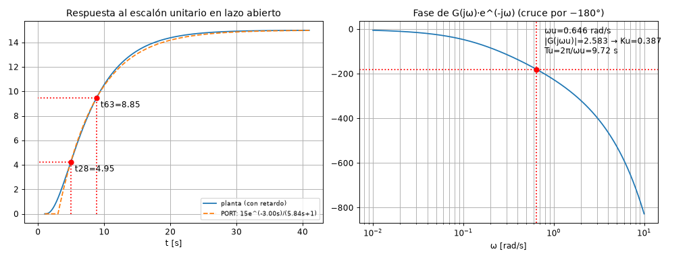
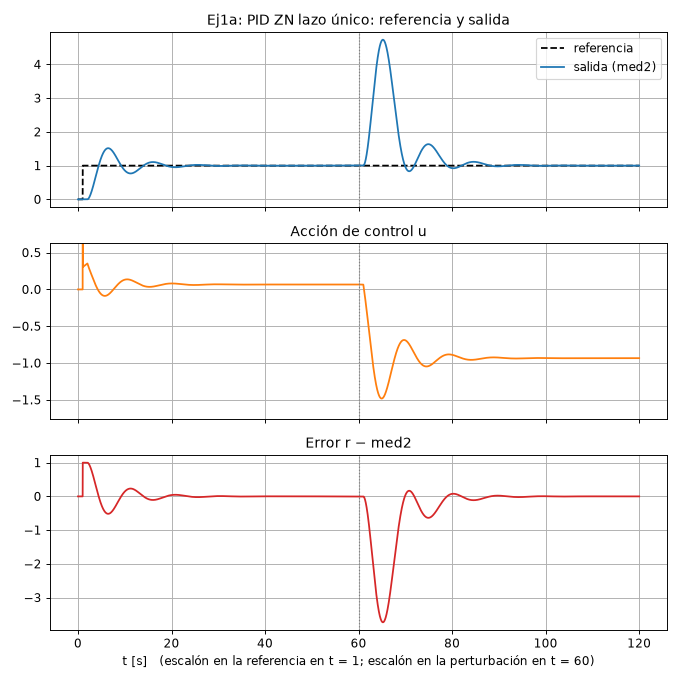
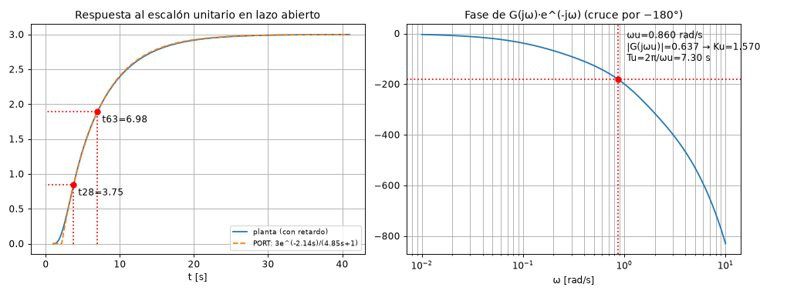
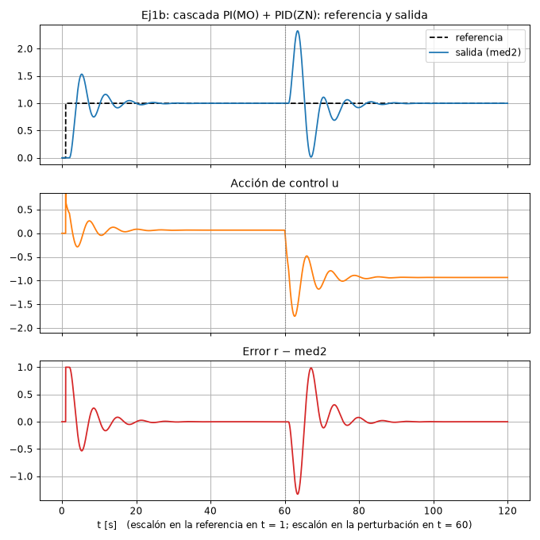
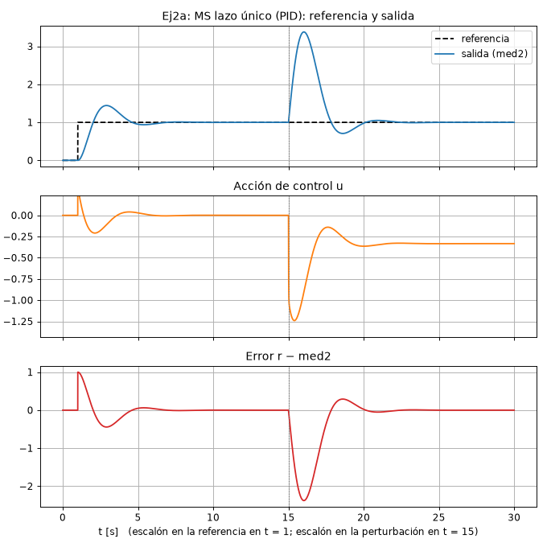
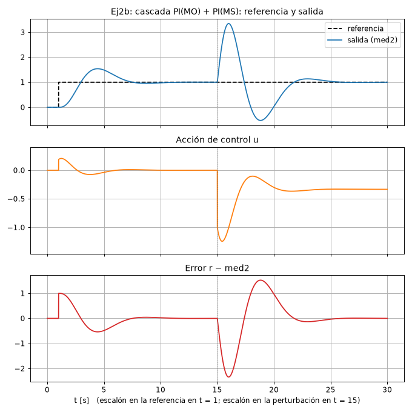
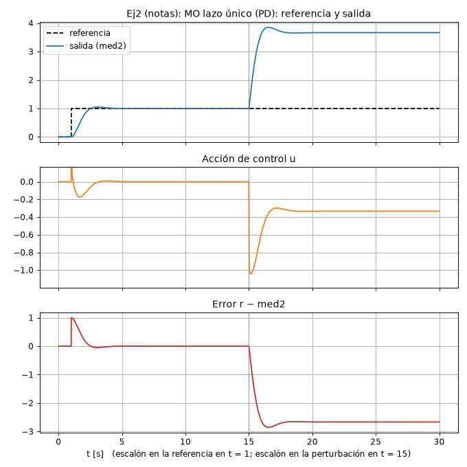
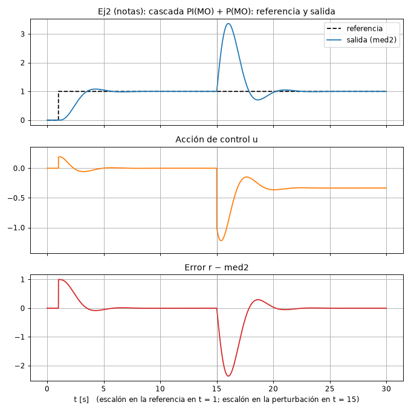

# CP-4: Control de plantas, resuelto paso a paso

**Archivos de esta carpeta**

| Archivo | Qué es |
|---|---|
| `cp4.m` | Script MATLAB con todos los cálculos (a1, a2, b1–b4 de ambos ejercicios) y las respuestas lineales del ej. 2. |
| `cp4_calc.py` | Los mismos cálculos en Python: de aquí salen los números de este documento. |
| `cp4_ident.py` | Gráficas de identificación: PORT con $t_{28}$/$t_{63}$ y Ku/Tu en el Bode (`a1_lazo_unico.png`, `b3_lazo_externo.png`). |
| `cp4_sim.py` | Simulación temporal equivalente al modelo Simulink. Genera los gráficos de referencia/salida, acción de control y error (`ej1a.png`, `ej1b.png`, `ej2a.png`, `ej2b.png`, `ej2_mo.png`, `ej2_momo.png`). |

**Condiciones de simulación (a3/b5):**
- Escalón unitario en la referencia en t = 1.
- Escalón unitario en `dist` en t = 60 s (ej. 1) o t = 15 s (ej. 2).
- PID en forma paralela $P+I/s+D\frac{N s}{s+N}$ con N = 100 (valor por defecto del bloque PID de Simulink) y D sobre el error.

---

# Ejercicio 1

$$\text{man}\to\underbrace{\frac{2}{s+2}}_{G_v=\frac{1}{0.5s+1}}\xrightarrow{+\,dist}\underbrace{\frac{5}{2s+1}}_{G_1}\to \text{med1}\to\underbrace{\frac{3}{5s+1}}_{G_2}\to e^{-1s}\to\text{med2}$$

Constantes de tiempo: 0.5, 2 y 5 s, más un **retardo de 1 s**. Ganancia total $1\cdot5\cdot3=15$.

## a) PID por Ziegler-Nichols para med2 (lazo único)

### a1) Ku y Tu (y modelo PORT)

```matlab
Ga = Gv*G1*G2;  Ga.InputDelay = 1;
[Gm,~,Wcg] = margin(Ga);  Ku = Gm;  Tu = 2*pi/Wcg;
```

Se busca la frecuencia donde la fase, **incluido el retardo**, vale −180°:
$$-\arctan(0.5\omega)-\arctan(2\omega)-\arctan(5\omega)-1\cdot\omega=-\pi\ \Rightarrow\ \omega_u=\mathbf{0.646\ rad/s}$$

Ahí $|G(j\omega_u)|=\dfrac{15}{\sqrt{1+0.104}\sqrt{1+1.67}\sqrt{1+10.44}}=2.583$, de modo que:

$$K_u=\frac{1}{2.583}=\mathbf{0.387}\qquad T_u=\frac{2\pi}{0.646}=\mathbf{9.72\ s}$$

Alternativa con el PORT (respuesta al escalón): $K=15$, $t_{28}=4.95$ y $t_{63}=8.85$, de donde $T=5.84$ s, $L=3.00$ s y $L/T=0.51$. Queda en el límite del rango de ZN, así que conviene usar Ku/Tu.



### a2) Parámetros ZN y forma paralela
PID serie (ZN): $K'_c=K_u/1.6=\mathbf{0.2420}$, $T'_i=T_u/2=\mathbf{4.862}$, $T'_d=T_u/8=\mathbf{1.215}$.

Pasado a ideal:
$$K_c=0.242\left(1+\tfrac{1.215}{4.862}\right)=0.3025,\quad T_i=4.862+1.215=6.077,\quad T_d=\tfrac{4.862\cdot1.215}{6.077}=0.972$$

Forma paralela:
$$\boxed{P=0.3025\qquad I=\frac{K_c}{T_i}=0.0498\qquad D=K_cT_d=0.2941}$$

### a3) Respuesta


## b) Cascada: PI interno por MO (med1) + PID externo por ZN (med2)

### b1) Controlador interno por módulo óptimo (desarrollo escrito)
1. Planta interna: $\text{med1}/\text{man}=G_vG_1=\dfrac{1}{0.5s+1}\cdot\dfrac{5}{2s+1}$, con $K=5$. La perturbación entra **dentro** de este lazo.
2. $T_u=0.5$ (la menor constante; no se compensa). Se compensa $T=2$.
3. Fórmula del MO con $K_r=1$:
$$G_{c1}=\frac{1}{2T_us(T_us+1)G_vG_1}=\frac{(0.5s+1)(2s+1)}{2(0.5)s(0.5s+1)\cdot5}=\frac{2s+1}{5s}$$

### b2) Forma paralela
$$\boxed{G_{c1}=0.4+\frac{0.2}{s}\qquad P=0.4,\ I=0.2,\ D=0\ (\textbf{PI})}$$

Lazo interno cerrado: $\dfrac{1}{2T_u^2s^2+2T_us+1}=\dfrac{1}{0.5s^2+s+1}=\dfrac{2}{s^2+2s+2}$.

### b3) Ku y Tu del lazo externo
Planta que "ve" el PID externo: $\dfrac{2}{s^2+2s+2}\cdot\dfrac{3}{5s+1}\cdot e^{-s}$. Se usa el lazo interno exacto, sin aproximarlo.
```matlab
Gb = feedback(Gc1*Gv*G1,1)*G2;  Gb.InputDelay = 1;
[Gm,~,Wcg] = margin(Gb);
```

Resultado: $\omega_u=0.860$ rad/s, $K_u=\mathbf{1.570}$ y $T_u=\mathbf{7.30\ s}$.

Con el PORT: $K=3$, $T=4.85$, $L=2.14$, $L/T=0.44$.



### b4) ZN y forma paralela
PID serie: $K'_c=0.981$, $T'_i=3.652$, $T'_d=0.913$.

Pasado a ideal: $K_c=1.226$, $T_i=4.564$, $T_d=0.730$.

$$\boxed{P=1.2264\qquad I=0.2687\qquad D=0.8956}$$

### b5) Respuesta


## c) Comparación, ejercicio 1

| Estrategia | $e_{ss}$ ref. | $M_p$ | $t_s$ (2 %) | Pico ante dist = 1 | $t_s$ perturbación | $e_{ss}$ pert. |
|---|---|---|---|---|---|---|
| a) PID ZN lazo único | 0 | 51.7 % | 25.2 s | **3.73** | 34.7 s | 0 |
| b) Cascada PI(MO) + PID(ZN) | 0 | 53.4 % | **21.2 s** | **1.33** | **26.7 s** | 0 |

### FT de lazo cerrado (cómo se escriben)

Misma receta de siempre (Resumen, sección 2.6): una ecuación por bloque, reemplazar y despejar. Aquí `dist` ($D$) se suma **entre $G_v$ y $G_1$**, y $e^{-s}$ es el retardo.

**a) Lazo único** ($U=G_c(R-Y)$, $Y=G_2e^{-s}G_1(G_vU+D)$):
$$Y\,(1+G_cG_vG_1G_2e^{-s})=G_cG_vG_1G_2e^{-s}\,R+G_1G_2e^{-s}\,D$$
$$\frac{Y}{R}=\frac{G_cG_vG_1G_2e^{-s}}{1+G_cG_vG_1G_2e^{-s}},\qquad \frac{Y}{D}=\frac{G_1G_2e^{-s}}{1+G_cG_vG_1G_2e^{-s}}$$
(Camino directo desde $D$: $G_1G_2e^{-s}$; no pasa por $G_c$ ni por $G_v$.)

**b) Cascada** ($U=G_{c1}\big(G_{c2}(R-Y)-M_1\big)$, $M_1=G_1(G_vU+D)$, $Y=G_2e^{-s}M_1$). Reemplazando $U$ y $Y$ en la ecuación de $M_1$:
$$M_1\,\big[1+G_vG_1G_{c1}\,(1+G_{c2}G_2e^{-s})\big]=G_vG_1G_{c1}G_{c2}\,R+G_1\,D$$
$$\frac{Y}{R}=\frac{G_{c2}\,G_{LC1}\,G_2e^{-s}}{1+G_{c2}\,G_{LC1}\,G_2e^{-s}},\quad G_{LC1}=\frac{G_{c1}G_vG_1}{1+G_{c1}G_vG_1}=\frac{2}{s^2+2s+2},\qquad
\frac{Y}{D}=\frac{G_1G_2e^{-s}}{1+G_vG_1G_{c1}\,(1+G_{c2}G_2e^{-s})}$$

**Lectura:** en la cascada, el denominador de $Y/D$ tiene el término $G_vG_1G_{c1}$ **sin retardo y sin $G_2$**: el lazo interno reacciona a `dist` apenas aparece en med1, sin esperar a que atraviese $G_2$ (5 s) y el retardo (1 s). Por eso el pico baja de 3.73 a 1.33. En $s=0$, ambos $Y/D$ valen 0 porque los controladores tienen integrador.

MATLAB (con `s = tf('s')`, `exp(-s)` es el retardo y `feedback` lo maneja sin problemas):
```matlab
Td_unico   = feedback(G1*G2*exp(-s), Gc*Gv);                    % Y/D lazo único
Td_cascada = G2*exp(-s)*feedback(G1, Gv*Gc1*(1 + Gc2*G2*exp(-s)));
```

**Comentarios:**
- **Error en estado estable:** es cero en ambos casos, ante la referencia y ante la perturbación, porque ambos lazos tienen integrador en el controlador.
- **Sobreimpulso:** es alto en los dos (≈ 52 %), típico de ZN con ¼ de razón de decrecimiento. Es agravado por el retardo. Si se quiere menos sobrepaso, hay que desintonizar (bajar $K_c$) o usar un prefiltro.
- **Referencia:** la cascada es algo más rápida (21 vs. 25 s). El lazo interno acelera la dinámica de $G_vG_1$: la reduce a un 2º orden con $\omega_n=\sqrt2$, de modo que el lazo externo tiene un $T_u$ menor (7.3 vs. 9.7 s) y admite más ganancia.
- **Perturbación: la gran ventaja de la cascada.** `dist` entra antes de $G_1$, **dentro** del lazo interno, que la detecta en med1 y la corrige antes de que atraviese $G_2$ y el retardo. El pico en med2 baja de 3.73 a 1.33 (**2.8 veces menor**) y se recupera antes.
- **Costo:** un sensor más (med1) y un controlador más. El pico de mando en t = 1 es el "golpe" derivativo (D sobre el error). Se evita derivando la medición.

---

# Ejercicio 2

$$\text{man}\to\underbrace{\frac{3}{s+3}}_{G_v=\frac{1}{\frac13s+1}}\to\underbrace{\frac{3}{2s+1}}_{G_1}\xrightarrow{+\,dist}\text{med1}\to\underbrace{\frac{4}{s}}_{G_2}\to\text{med2}$$

La planta completa es $G_p=\dfrac{12}{s(\frac13s+1)(2s+1)}$: **tipo 1**, con $T_u=1/3$ y $K=12$. Es el caso c) del ejercicio 1 del CP-3.

## a) Módulo simétrico en lazo único (med2)

### a1) Desarrollo
$$G_c=\frac{4T_us+1}{8T_u^2s^2(T_us+1)G_p}=\frac{(\frac43s+1)\,s(\frac13s+1)(2s+1)}{8\cdot\frac19\,s^2(\frac13s+1)\cdot12}=\frac{(\frac43s+1)(2s+1)}{\frac{32}{3}s}$$

### a2) Forma paralela
$$G_c=\frac{\frac83s^2+\frac{10}{3}s+1}{\frac{32}{3}s}=\frac{0.25s^2+0.3125s+0.09375}{s}\ \Rightarrow\ \boxed{P=0.3125,\ I=0.09375,\ D=0.25}\ (\textbf{PID})$$

Coincide con las notas de la guía. Como referencia, el MO en lazo único da $G_c=\dfrac{2s+1}{8}=0.125+0.25s$ (**PD**).

### a3) Respuesta


## b) Cascada: interno MO (med1) + externo MS (med2)

### b1) Controlador interno por MO (desarrollo)
Planta interna: $G_vG_1=\dfrac{3}{(\frac13s+1)(2s+1)}$, con $T_u=\frac13$ y $K=3$:
$$G_{c,in}=\frac{(\frac13s+1)(2s+1)}{2\cdot\frac13\,s(\frac13s+1)\cdot3}=\frac{2s+1}{2s}$$

### b2) Forma paralela
$$\boxed{G_{c,in}=\frac{s+0.5}{s}=1+\frac{0.5}{s}\qquad P=1,\ I=0.5\ (\textbf{PI})}$$

Lazo interno cerrado: $\dfrac{1}{\frac29s^2+\frac23s+1}=\dfrac{4.5}{s^2+3s+4.5}\approx\dfrac{1}{\frac23s+1}$.

### b3) Controlador externo por MS (desarrollo)
La planta externa, aproximando el lazo interno, es $\dfrac{1}{\frac23s+1}\cdot\dfrac4s$, con $T_u=\frac23$ y $K=4$:
$$G_{c,ex}=\frac{(4\cdot\frac23s+1)\,s(\frac23s+1)}{8\cdot\frac49\,s^2(\frac23s+1)\cdot4}=\frac{\frac83s+1}{\frac{128}{9}s}$$

### b4) Forma paralela
$$\boxed{G_{c,ex}=\frac{0.1875s+0.07031}{s}=0.1875+\frac{0.07031}{s}\qquad P=0.1875,\ I=0.07031\ (\textbf{PI})}$$

> **Ojo con las notas de la guía:** allí aparece "Gcexmo" igual a "Gcexms", pero es un error de tipeo. Por MO, el externo es $\dfrac{1}{2T_us(T_us+1)}\cdot\dfrac{s(T_us+1)}{4}=\dfrac{1}{8T_u}=\mathbf{0.1875}$, **un P** (la planta externa ya tiene integrador).

### b5) Respuesta


Para comparar, las otras dos variantes de las notas:




## c) Comparación, ejercicio 2

| Estrategia | $e_{ss}$ ref. | $M_p$ | $t_s$ (2 %) | Pico ante dist = 1 | $t_s$ perturbación | $e_{ss}$ pert. | $\lvert u\rvert_{max}$ |
|---|---|---|---|---|---|---|---|
| **a) MS lazo único (PID)** | 0 | 44 % | 5.4 s | 2.38 | 6.9 s | **0** | 25 (golpe D) |
| MO lazo único (PD), de las notas | 0 | **4.8 %** | **2.8 s** | 2.86 | no se recupera | **−2.67** | 25 (golpe D) |
| **b) Cascada MO + MS (2 PI)** | 0 | 54 % | 9.2 s | 2.34 | 10.3 s | **0** | **1.24** |
| Cascada MO + MO (PI + P), de las notas | 0 | 8.2 % | 4.4 s | 2.37 | 7.0 s | **0** | **1.22** |

### FT de lazo cerrado (cómo se escriben)

Aquí `dist` ($D$) se suma **a la salida de $G_1$**, justo donde se mide med1. Sea $G_i=G_vG_1$.

**Lazo único** ($U=G_c(R-Y)$, $M_1=G_iU+D$, $Y=G_2M_1$):
$$\frac{Y}{R}=\frac{G_cG_iG_2}{1+G_cG_iG_2},\qquad \frac{Y}{D}=\frac{G_2}{1+G_cG_iG_2}$$
Error final ante $D$ escalón: $Y/D(0)$. Como $G_2=4/s\to\infty$, se divide arriba y abajo por $G_2$: $\;Y/D(0)=\dfrac{1}{G_c(0)G_i(0)}$.
- MO (PD, $G_c(0)=0.125$): $\dfrac{1}{0.125\cdot3}=\mathbf{2.67}$. Queda error (el −2.67 de la tabla es $e=r-y$).
- MS (PID, $G_c(0)=\infty$): $0$.

**Cascada** ($U=G_{c,in}\big(G_{c,ex}(R-Y)-M_1\big)$, $M_1=G_iU+D$, $Y=G_2M_1$):
$$M_1\,\big[1+G_iG_{c,in}(1+G_{c,ex}G_2)\big]=G_iG_{c,in}G_{c,ex}\,R+D$$
$$\frac{Y}{R}=\frac{G_{c,ex}G_{LC1}G_2}{1+G_{c,ex}G_{LC1}G_2},\quad G_{LC1}=\frac{G_{c,in}G_i}{1+G_{c,in}G_i}=\frac{4.5}{s^2+3s+4.5},\qquad
\frac{Y}{D}=\frac{G_2}{1+G_iG_{c,in}\,(1+G_{c,ex}G_2)}$$
En $s=0$, $G_{c,in}\to\infty$ (PI interno), así que $Y/D(0)=0$ **aunque el externo sea solo un P** (MO + MO). Es la explicación de la tabla: el integrador que importa es el del controlador cuyo lazo contiene el punto donde entra la perturbación.

En `cp4.m`: `feedback(G2, Gc*Gi)` (lazo único) y `G2*feedback(1, Gi*Gcin*(1 + Gcex*G2))` (cascada).

**Comentarios:**
- **Error en estado estable ante la referencia:** es cero en todas, porque la planta ya es tipo 1.
- **Error ante la perturbación:**
  - **MO lazo único (PD):** el integrador lo pone la planta y está *después* del punto de entrada de la perturbación, así que queda error: $y_{ss}=\dfrac{G_2}{G_cG_vG_1G_2}\Big|_{s\to0}=\dfrac{4}{0.125\cdot12}=2.67$.
  - **MS lazo único:** lo elimina gracias al integrador del controlador.
  - **Cascada MO + MO:** también lo elimina, aunque el externo sea un P, porque la perturbación entra en med1 y el **PI interno** la corrige.
- **Sobreimpulso:**
  - Los diseños con MS sobrepasan mucho: 44 % en lazo único y 54 % en cascada. Es lo esperable del MS; en cascada es peor porque la aproximación de 1er orden del lazo interno no es exacta.
  - Los MO quedan cerca del 4 % teórico: 4.8 % en lazo único y 8.2 % en cascada.
- **Rapidez:** el lazo único es más rápido (2.8–5.4 s), porque la constante no compensada es $T_u=1/3$. En cascada, el externo tiene $T_u=2/3$, el doble, y responde más lento (4.4–9.2 s).
- **Acción de control:** es la diferencia práctica más grande.
  - Los lazos únicos necesitan acción D (PID o PD), con un golpe derivativo de ≈ 25 ante un escalón en la referencia.
  - En cascada bastan **dos PI**, sin derivada, y el mando no pasa de ≈ 1.2: **20 veces menor**, mucho más realista para un actuador.
- **Conclusión (coincide con las notas):**
  - MS lazo único: rápido, pero con sobrepaso.
  - MO lazo único: rápido, pero con error ante la perturbación.
  - Cascada MO + MS: más lenta y con sobrepaso.
  - **Cascada MO + MO:** algo más lenta, pero **sin sobrepaso importante ni error ante la perturbación**, con reguladores simples y un mando suave. **Es la mejor opción global.**

---

## Cómo armarlo en Simulink (a3/b5 de ambos ejercicios)

1. Planta tal como el diagrama del enunciado:
   - Ej. 1: *Transfer Fcn* $G_v$, *Sum* con `dist`, $G_1$, salida `med1`, $G_2$ y *Transport Delay* (1 s), salida `med2`.
   - Ej. 2: $G_v$, $G_1$, *Sum* con `dist`, salida `med1`, $G_2=4/s$, salida `med2`.
2. **Lazo único:** *Step* (referencia, t = 1) → *Sum* (+ −) con med2 → *PID Controller* (Parallel, P, I, D, N = 100) → `man`.
3. **Cascada:** *Step* → *Sum* (+ −, med2) → PID externo → *Sum* (+ −, med1) → PI interno → `man`.
4. *Step* en `dist` (t = 60 en el ej. 1, t = 15 en el ej. 2).
5. Tres *Scope*, como pide el enunciado:
   - referencia y med2, con un *Mux*;
   - acción de control `man`;
   - error (salida del Sum externo).
