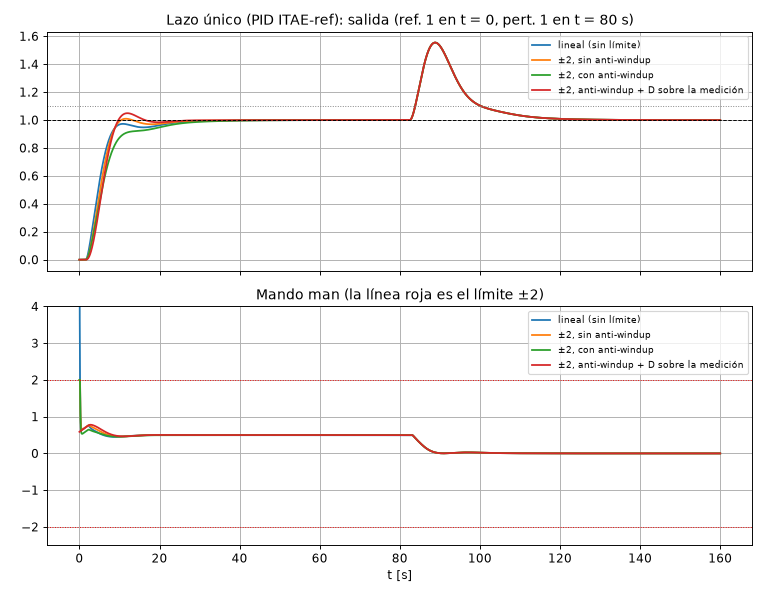
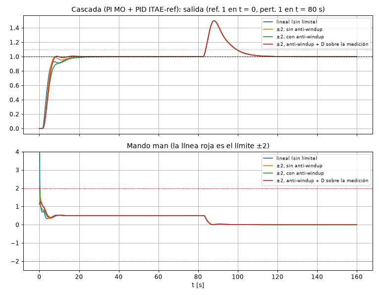
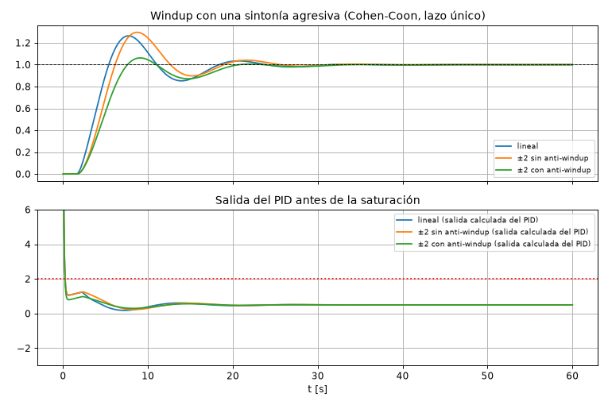
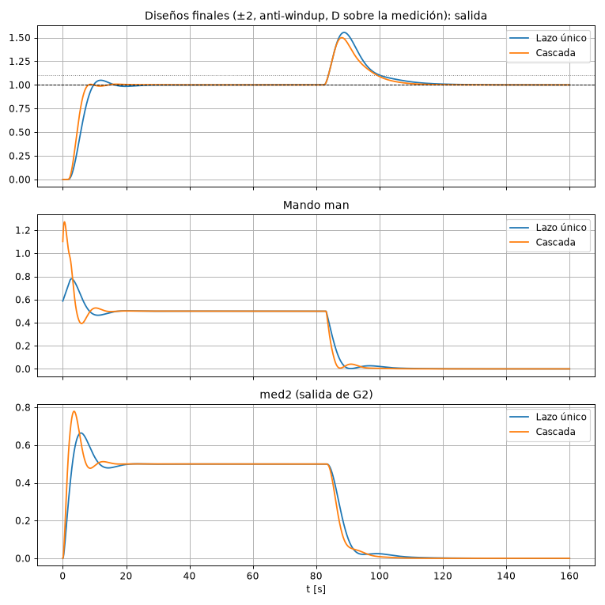

# Certamen 1 Control de Procesos 2025, resuelto paso a paso

**Archivos de esta carpeta**

| Archivo | Qué es |
|---|---|
| `cert1.m` | Script MATLAB: modelo, Ku/Tu, PORT, sintonías, controlador interno por MO y respuestas lineales. |
| `cert_calc.py` | Identificación (Ku, Tu, PORT) en Python, para verificar los números. |
| `cert_sim.py` | Simulación temporal equivalente al modelo Simulink (retardos, saturación ±2, anti-windup, D sobre la medición). |
| `cert_tune.py` | Barrido de sintonías (ZN, CC, IAE, ITAE) en ambas estrategias. De aquí sale la tabla del paso 5. |
| `cert_plots.py` | Genera `fig_unico.png`, `fig_cascada.png`, `fig_comparacion.png` y `fig_windup.png`. |

---

## 0. Enunciado

```
 pert ──►[ Gp = 1/(3s+2) ]──►[ e^{-1·s} ]─────────────┐
                                                        ▼+
 man ──►[ G1 = 4/(s+2) ]──►[ G2 = 0.5/(2s+1) ]──┬──►( Σ )──►[ G3 = 2/(4s+1) ]──►[ e^{-1.5·s} ]──┬──► salida
                                                │    +                                          │
                                                └──► med2                                       ▼
                                  med1 ◄──[ e^{-0.5·s} ]◄──[ Gs = 10/(s+10) ]◄──────────────────┘
```

- El mando **man** está limitado a **±2**.
- Se dispone de **med1** (la salida medida por el sensor Gs, con retardo 0.5 s). Se **podría instalar** un sensor en **med2**.
- Especificaciones:
  - error cero en estado estable ante escalones unitarios en la referencia y en la perturbación;
  - tiempo de subida **< 10 s**;
  - sobrepaso **≤ 10 %**.
- Pedido: diseñar una estrategia con **un solo lazo** y otra con **mando subordinado** (cascada), compararlas considerando la saturación del mando y el anti-windup, y decidir cuál es mejor.

---

## 1. Análisis de la planta (lo primero que hay que escribir)

**Forma de constantes de tiempo** (dividir por el término independiente):

$$G_1=\frac{4}{s+2}=\frac{2}{0.5s+1},\qquad G_2=\frac{0.5}{2s+1},\qquad G_3=\frac{2}{4s+1},\qquad G_s=\frac{10}{s+10}=\frac{1}{0.1s+1},\qquad G_p=\frac{1}{3s+2}=\frac{0.5}{1.5s+1}$$

| Camino | FT | Ganancia | Constantes de tiempo | Retardo |
|---|---|---|---|---|
| man → med2 | $G_1G_2$ | $2\cdot0.5=1$ | 0.5 y 2 s | 0 |
| man → salida | $G_1G_2G_3e^{-1.5s}$ | 2 | 0.5, 2 y 4 s | 1.5 s |
| man → med1 | $G_1G_2G_3G_se^{-2s}$ | 2 | 0.5, 2, 4 y 0.1 s | **2 s** |
| pert → salida | $G_pe^{-s}G_3e^{-1.5s}$ | $0.5\cdot2=1$ | 1.5 y 4 s | 2.5 s |

**Observaciones que justifican el diseño:**

1. **Error cero ante escalones.** La planta es tipo 0, así que el controlador necesita **acción integral** (PI o PID). Para la perturbación, el integrador tiene que estar en el controlador (Resumen, sección 2.5).
2. **Mando en estado estable.**
   - Referencia unitaria: $man_{ss}=1/2=0.5$.
   - Perturbación unitaria: hay que compensar $1\cdot1=1$ en la salida, así que $\Delta man_{ss}=-1/2=-0.5$.
   - Las dos caben de sobra en ±2. **La saturación solo afecta los transitorios** (sobre todo el golpe derivativo y los integradores durante el arranque).
3. **Hay retardos.**
   - El módulo óptimo y el simétrico necesitan el **inverso** de la planta, y $e^{+Ls}$ no es realizable. Por eso **no se pueden usar en un lazo que contenga retardo** (Resumen, conclusiones de la Conf. 3).
   - Donde hay retardo se usa una **regla de sintonía** (ZN, CC o criterios integrales) sobre un modelo PORT.
   - El único lazo sin retardo es **man → med2**, así que ahí sí se puede usar MO (lazo interno de la cascada).
4. **Dónde entra la perturbación.**
   - `pert` se suma **después** de med2.
   - Si se cierra un lazo interno con med2, la perturbación queda **fuera** de ese lazo: el interno no la ve.
   - La cascada mejorará el rechazo a la perturbación solo porque hace más rápido el lazo externo, **no** porque el interno la corrija. Esto se demuestra en el paso 4.3.
5. **Qué se controla.** La variable controlada es la salida. Se realimenta a través de med1 ($G_s$, ganancia 1, más 0.5 s de retardo).

---

## 2. Estrategia A: un solo lazo (PID sobre med1)

### 2.1 Identificación: Ku, Tu y modelo PORT de man → med1

```matlab
Gm = G1*G2*G3*exp(-1.5*s)*Gs*exp(-0.5*s);
[Ku,~,wu] = margin(Gm);  Tu = 2*pi/wu;          % ganancia y período críticos
[K,T,L] = port(Gm);                              % 28 % y 63 % de la respuesta al escalón
```

| Parámetro | Valor |
|---|---|
| $K_u$ | **1.586** |
| $\omega_u$ | 0.490 rad/s |
| $T_u$ | **12.83 s** |
| $K$ | **2.00** |
| $t_{28}$ | 5.635 s |
| $t_{63}$ | 8.963 s |
| $T=1.5(t_{63}-t_{28})$ | **4.99 s** |
| $L=t_{63}-T$ | **3.97 s** |
| $L/T$ | **0.795** |

**Elección de la regla:**
- $L/T=0.795$ está **fuera** del rango de validez de Ziegler-Nichols (0.1–0.5), pero **dentro** del de los criterios integrales (0.1–1).
- Como se exige sobrepaso ≤ 10 %, la regla natural es un criterio integral **para cambios en la referencia** (Rovira). ZN y Cohen-Coon apuntan a ¼ de razón de decrecimiento (sobrepaso ≈ 50 %).

### 2.2 Sintonía PID por ITAE para la referencia (PID ideal)

$$K_c=\frac{0.965}{K}\left(\frac{L}{T}\right)^{-0.855}=\frac{0.965}{2}(0.795)^{-0.855}=\mathbf{0.587}$$

$$T_i=\frac{T}{0.796-0.147\,(L/T)}=\frac{4.99}{0.796-0.147\cdot0.795}=\mathbf{7.35\ s}$$

$$T_d=0.308\,T\left(\frac{L}{T}\right)^{0.929}=0.308\cdot4.99\cdot0.795^{0.929}=\mathbf{1.243\ s}$$

Paso a **paralelo** (lo que pide el bloque PID de Simulink): $P=K_c$, $I=K_c/T_i$, $D=K_cT_d$.

$$\boxed{P=0.5868,\qquad I=0.0798,\qquad D=0.7294}$$

Parámetros prácticos:
- Filtro derivativo: $N=10$ rad/s ($1/N=0.1$ s, del orden de la constante más rápida).
- Anti-windup por back-calculation: $K_b=1/\sqrt{T_iT_d}=1/\sqrt{7.35\cdot1.243}=\mathbf{0.331}$.
- Derivada **sobre la medición**, para evitar el golpe derivativo que saturaría el mando.

### 2.3 FT de lazo cerrado (receta del Resumen, sección 2.6)

Sea $G_{my}=G_1G_2G_3e^{-1.5s}$ (man → salida), $H=G_se^{-0.5s}$ (salida → med1) y $G_d=G_pe^{-s}G_3e^{-1.5s}$ (pert → salida).

Ecuaciones:
- $man=C\,(r-med_1)$ (con D sobre el error);
- $y=G_{my}\,man+G_d\,d$;
- $med_1=H\,y$.

Reemplazando y despejando:

$$\frac{Y}{R}=\frac{C\,G_{my}}{1+C\,G_{my}H},\qquad \frac{Y}{D}=\frac{G_d}{1+C\,G_{my}H}$$

Con D sobre la medición, la referencia solo pasa por la parte PI ($C_r=P+I/s$) y el denominador no cambia: $\dfrac{Y}{R}=\dfrac{C_r\,G_{my}}{1+C\,G_{my}H}$.

Error cero: en $s=0$, $C\to\infty$ (integrador), así que $Y/R(0)=1/H(0)=1$ e $Y/D(0)=0$ ✔.

---

## 3. Estrategia B: mando subordinado (cascada med2 / med1)

### 3.1 Lazo interno (sensor en med2) por módulo óptimo

- Planta interna: $G_i=G_1G_2=\dfrac{1}{(0.5s+1)(2s+1)}$, con $K=1$ y **sin retardo**. Se puede usar MO.
- $T_u=0.5$ s es la menor constante; **no se compensa**. La de 2 s sí.
- Sensor de med2 ideal: $K_r=1$.

$$G_{c1}=\frac{1}{K_r\,2T_us\,(T_us+1)\,G_i}=\frac{(0.5s+1)(2s+1)}{2\cdot0.5\,s\,(0.5s+1)}=\frac{2s+1}{s}$$

$$\boxed{G_{c1}=2+\frac{1}{s}\qquad P=2,\ I=1\ (\textbf{PI}),\qquad K_b=1/T_i=0.5}$$

Lazo interno cerrado:

$$G_{LC1}=\frac{G_{c1}G_i}{1+G_{c1}G_i}=\frac{1}{2T_u^2s^2+2T_us+1}=\frac{2}{s^2+2s+2}\ \approx\ \frac{1}{2T_us+1}=\frac{1}{s+1}$$

El interno reemplaza las constantes 0.5 y 2 s por un 2º orden con $\zeta=0.707$ de constante efectiva ≈ 1 s. **Se acelera la parte de la planta que ve el lazo externo.**

### 3.2 Lazo externo (med1) por ITAE para la referencia

- Planta que ve el externo: $G_o=G_{LC1}\,G_3\,e^{-1.5s}\,G_s\,e^{-0.5s}$.
- **Tiene los 2 s de retardo**, así que no se puede usar MO/MS: se identifica y se usa una regla, igual que en el lazo único.
- Se usa el lazo interno **exacto** (no la aproximación de 1er orden).

| Parámetro | Valor |
|---|---|
| $K_u$ | 1.363 |
| $T_u$ | 10.15 s |
| $K$ | **2.00** |
| $t_{28}$ | 4.537 s |
| $t_{63}$ | 7.080 s |
| $T$ | **3.815 s** |
| $L$ | **3.265 s** |
| $L/T$ | **0.856** |

$L/T=0.856$: de nuevo fuera de ZN y dentro de los criterios integrales. ITAE-referencia:

$$K_c=\frac{0.965}{2}(0.856)^{-0.855}=0.551,\qquad T_i=\frac{3.815}{0.796-0.147\cdot0.856}=5.692,\qquad T_d=0.308\cdot3.815\cdot0.856^{0.929}=1.017$$

$$\boxed{P=0.5512,\qquad I=0.0968,\qquad D=0.5605,\qquad N=10,\qquad K_b=1/\sqrt{T_iT_d}=0.416}$$

Con derivada sobre la medición (med1).

### 3.3 FT de lazo cerrado de la cascada

Ecuaciones:
- $r_2=C_2\,(r-med_1)$ (salida del externo = referencia de med2);
- $man=C_1\,(r_2-med_2)$;
- $med_2=G_i\,man$;
- $y=G_3e^{-1.5s}(med_2+G_pe^{-s}d)$;
- $med_1=H\,y$.

Reemplazando $man$ en $med_2$: $med_2=G_{LC1}\,r_2$. Con eso:

$$\frac{Y}{R}=\frac{C_2\,G_{LC1}\,G_3e^{-1.5s}}{1+C_2\,G_{LC1}\,G_3e^{-1.5s}\,H},\qquad
\frac{Y}{D}=\frac{G_pe^{-s}\,G_3e^{-1.5s}}{1+C_2\,G_{LC1}\,G_3e^{-1.5s}\,H}$$

**Lectura importante:**
- En $Y/D$ el numerador es el **mismo** que en el lazo único, porque la perturbación entra **después** de med2, fuera del lazo interno.
- Lo único que cambia es el denominador: $G_{LC1}$ (≈ 1 s) en vez de $G_1G_2$ (0.5 y 2 s). El lazo externo es más rápido y corrige un poco antes.
- Si la perturbación entrara **antes** de med2 (por ejemplo, en man), el numerador sería $\frac{G_iG_3e^{-1.5s}}{1+G_iG_{c1}(\ldots)}$ y el interno la rechazaría casi solo, como en CP-4 ejercicio 1. Aquí **no** es el caso.

---

## 4. Simulación con saturación ±2 y anti-windup

**Condiciones:**
- Referencia escalón 1 en t = 0.
- Perturbación escalón 1 en t = 80 s.
- Mando man saturado a ±2.
- Anti-windup por back-calculation.
- En la cascada, la saturación y el anti-windup van en el **interno** (el que genera man). El externo también se limita a ±2, porque med2 en estado estable es igual a man.

### 4.1 Barrido de sintonías

¿Por qué ITAE-referencia? Se muestra con saturación ±2, anti-windup y **D sobre el error**, y con **D sobre la medición**. $t_r$ es el tiempo de subida 10–90 %.

**Lazo único:**

| Regla | P / I / D | $M_p$ (D sobre e) | $M_p$ (D sobre med.) | $t_r$ | $t_s$ (2 %) | Pico ante pert. | ¿Cumple? |
|---|---|---|---|---|---|---|---|
| ZN ($K_u$) | 1.239 / 0.154 / 1.590 | 15.9 % | 49.9 % | 2.5 s | 38 s | 0.47 | ✘ sobrepaso |
| Cohen-Coon | 0.963 / 0.128 / 1.215 | 6.2 % | 32.6 % | 3.1 s | 25 s | 0.50 | ✘ sobrepaso con D sobre med. |
| ITAE-pert. | 0.843 / 0.168 / 1.276 | 13.8 % | 42.1 % | 3.1 s | 22 s | 0.50 | ✘ sobrepaso |
| IAE-ref. | 0.663 / 0.085 / 0.934 | 0.0 % ($t_r$ = 12.5 s ✘) | 6.0 % | 4.6 s | 13.6 s | 0.53 | ✔ (con D sobre med.) |
| **ITAE-ref. PID** | **0.587 / 0.080 / 0.729** | 0.0 % ($t_r$ = 8.2 s) | **4.9 %** | **5.1 s** | **14.8 s** | **0.56** | **✔** |
| ITAE-ref. PI | 0.361 / 0.065 / – | 5.0 % | 5.0 % | 7.2 s | 29.6 s | 0.66 | ✔ (más lento) |

**Cascada** (interno PI MO; la tabla es para el externo):

| Regla externo | P / I / D | $M_p$ (D sobre e) | $M_p$ (D sobre med.) | $t_r$ | $t_s$ (2 %) | Pico ante pert. | ¿Cumple? |
|---|---|---|---|---|---|---|---|
| ZN ($K_u$) | 1.065 / 0.168 / 1.080 | 51.9 % | 51.9 % | 2.0 s | 42 s | 0.43 | ✘ |
| Cohen-Coon | 0.904 / 0.148 / 0.929 | 35.9 % | 36.1 % | 2.2 s | 26 s | 0.45 | ✘ |
| ITAE-pert. | 0.786 / 0.195 / 0.979 | 40.5 % | 41.6 % | 2.2 s | 21 s | 0.45 | ✘ |
| IAE-ref. | 0.622 / 0.103 / 0.716 | 1.7 % | 3.4 % | 3.2 s | 12.7 s | 0.48 | ✔ |
| **ITAE-ref. PID** | **0.551 / 0.097 / 0.561** | 0.2 % | **0.8 %** | **3.7 s** | **7.5 s** | **0.50** | **✔** |
| ITAE-ref. PI | 0.338 / 0.079 / – | 2.2 % | 2.2 % | 5.9 s | 14.6 s | 0.61 | ✔ |

Conclusión del barrido:
- Las reglas de ¼ de razón de decrecimiento (ZN, CC) y las de perturbación **no cumplen** el 10 % de sobrepaso.
- Las de referencia sí. Se elige **ITAE-referencia**, que es la más conservadora: deja margen respecto del 10 % y del $t_r$ < 10 s.

### 4.2 Diseños elegidos: efecto de la saturación y del anti-windup

**Lazo único** (PID ITAE-ref.):

| Caso | $M_p$ | $t_r$ | $t_s$ | $\lvert man\rvert_{max}$ | Pico pert. | $t_s$ pert. | $e_{ss}$ |
|---|---|---|---|---|---|---|---|
| Lineal (sin límite), D sobre e | 0.0 % | 5.4 s | 23.6 s | **7.9** (irrealizable) | 0.555 | 33.6 s | 0 |
| ±2 sin anti-windup, D sobre e | 1.0 % | 5.4 s | 21.9 s | 2 (satura) | 0.555 | 33.6 s | 0 |
| ±2 con anti-windup, D sobre e | 0.0 % | 8.2 s | 26.5 s | 2 (satura) | 0.555 | 33.6 s | 0 |
| **±2, anti-windup, D sobre la medición** | **4.9 %** | **5.1 s** | **14.8 s** | **0.78** | 0.555 | 33.6 s | **0** |



**Cascada** (PI MO + PID ITAE-ref.):

| Caso | $M_p$ | $t_r$ | $t_s$ | $\lvert man\rvert_{max}$ | Pico pert. | $t_s$ pert. | $e_{ss}$ |
|---|---|---|---|---|---|---|---|
| Lineal (sin límite), D sobre e | 0.0 % | 3.9 s | 15.4 s | **12.3** (irrealizable) | 0.500 | 28.0 s | 0 |
| ±2 sin anti-windup, D sobre e | 0.0 % | 3.5 s | 14.5 s | 2 (satura) | 0.500 | 28.0 s | 0 |
| ±2 con anti-windup, D sobre e | 0.0 % | 6.2 s | 16.8 s | 2 (satura) | 0.500 | 28.0 s | 0 |
| **±2, anti-windup, D sobre la medición** | **0.8 %** | **3.7 s** | **7.5 s** | **1.27** | **0.500** | **28.0 s** | **0** |



**Cómo leer estas tablas:**

1. **Con D sobre el error**, el escalón en la referencia produce un **golpe derivativo** (man = 7.9 o 12.3 en el lineal) que el actuador no puede entregar: satura en +2.
   - *Sin* anti-windup, en estos diseños conservadores casi no se nota. El windup dura poco porque el integrador es lento ($I$ pequeño).
   - *Con* back-calculation, mientras dura el golpe la integral se "descarga" ($K_b(u_s-u)<0$) y la respuesta queda **más lenta** ($t_r$ 5.4 → 8.2 s).
   - El problema de fondo es el golpe derivativo, no el windup.
2. **Con D sobre la medición** el golpe desaparece. El mando queda **dentro de ±2 todo el tiempo** (0.78 y 1.27), la respuesta es la más rápida y el anti-windup queda como protección (no se activa). Es la configuración recomendada.
3. **El windup sí importa con sintonías agresivas.** Con Cohen-Coon en lazo único (figura siguiente), la saturación sin anti-windup sube el sobrepaso de 26 % a 30 %; con back-calculation baja a 6 %.



### 4.3 Comparación de los diseños finales



| | Lazo único | Cascada | Mejora |
|---|---|---|---|
| Sobrepaso | 4.9 % | **0.8 %** | ✔ |
| Tiempo de subida (10–90 %) | 5.1 s | **3.7 s** | ✔ |
| Tiempo de establecimiento (2 %) | 14.8 s | **7.5 s** | 2 veces más rápido |
| Pico ante perturbación unitaria | 0.555 | **0.500** | 10 % menor |
| Recuperación ante perturbación | 33.6 s | **28.0 s** | 17 % más rápida |
| Error en estado estable (ref. y pert.) | 0 | 0 | = |
| Mando máximo | 0.78 | 1.27 | ambos dentro de ±2 |
| Sensores / controladores | 1 / 1 | 2 / 2 | costo de la cascada |

Ambos cumplen **todas** las especificaciones ($e_{ss}=0$, $t_r<10$ s, $M_p\le10\,\%$).

---

## 5. Conclusión: ¿cuál es la más adecuada?

**La cascada (mando subordinado) es la más adecuada**, siempre que se instale el sensor en med2:

1. **Mejor respuesta a la referencia.** El PI interno por MO convierte las constantes de 0.5 y 2 s en un lazo de ≈ 1 s. El externo ve una planta más rápida: $T_u$ 12.8 → 10.1 s y $T$ 5.0 → 3.8 s. Resultado: establecimiento en 7.5 s contra 14.8 s, con menos sobrepaso (0.8 % vs. 4.9 %).
2. **Mejor manejo de la saturación.** El límite ±2 y el anti-windup quedan en el lazo interno, que es rápido y no tiene retardo. Si el actuador satura, el interno se recupera en pocos segundos y el externo solo ve una referencia de med2 que se cumple con retraso. Además, cualquier no linealidad o cambio en $G_1$ o $G_2$ (por ejemplo, la ganancia de un actuador) la corrige el interno antes de que llegue a la salida.
3. **Rechazo a la perturbación: mejora poco.** La perturbación entra **después** de med2, fuera del lazo interno, así que el interno no la ve ($Y/D$ tiene el mismo numerador en ambas estrategias, paso 3.3). La pequeña mejora (pico 0.555 → 0.500, recuperación 33.6 → 28 s) viene solo de que el lazo externo es más rápido. El pico está dominado por los 2.5 s de retardo del camino de la perturbación, que ninguna de las dos estrategias puede evitar.
4. **Costo:** un sensor adicional (med2) y un segundo controlador, aunque es un PI simple.

Si no se puede instalar el sensor en med2, el **PID de lazo único por ITAE-referencia, con derivada sobre la medición y anti-windup**, también cumple todas las especificaciones. Es una solución válida, solo que más lenta.

---

## 6. Diagramas de Simulink

### Modelo A: lazo único (PID sobre med1)

```
                                        [Step pert, t=80]──►[ Gp ]──►[Transport Delay 1]──┐
                                                                                            ▼+
 [Step r]──►[ PID Controller (2DOF) ]── u ──►[Saturation ±2]── man ──►[ G1 ]──►[ G2 ]──┬─►( Σ )──►[ G3 ]──►[Transport Delay 1.5]──┬── salida ──►[Scope]
    r ─────►│Ref                    │                                                  │   +                                      │
      ┌────►│y                      │                                                  └── med2 ──►[Scope]                         │
      │                                                                                                                             │
      └── med1 ◄──[Transport Delay 0.5]◄──[ Gs ]◄────────────────────────────────────────────────────────────────────────────────────┘
```

(Si se usa la saturación interna del bloque PID, el bloque *Saturation* no hace falta.)

**Qué es cada señal:**

| Símbolo | Qué es |
|---|---|
| r | Referencia de la salida (escalón 1 en t = 0) |
| u / man | Salida del PID = mando real, limitado a ±2 |
| med2 | Salida de G2. En el modelo A no se usa, solo se grafica |
| pert | Perturbación (escalón 1 en t = 80 s), pasa por Gp y su retardo de 1 s |
| salida | Variable controlada (lo que se evalúa: $M_p$, $t_r$, $e_{ss}$) |
| med1 | Salida medida por Gs con 0.5 s de retardo. Es la que se realimenta al PID (entrada **y** del bloque 2DOF) |

**Parámetros de los bloques:**

| Bloque | Parámetros |
|---|---|
| G1 | Transfer Fcn: Num `4`, Den `[1 2]` |
| G2 | Transfer Fcn: Num `0.5`, Den `[2 1]` |
| G3 | Transfer Fcn: Num `2`, Den `[4 1]` |
| Gs | Transfer Fcn: Num `10`, Den `[1 10]` |
| Gp | Transfer Fcn: Num `1`, Den `[3 2]` |
| Transport Delay (pert.) | Time delay = **1** |
| Transport Delay (G3) | Time delay = **1.5** |
| Transport Delay (sensor) | Time delay = **0.5** |
| Σ (antes de G3) | List of signs `++` |
| **PID Controller (2DOF)** | Controller: PID. Form: **Parallel**. **P = 0.5868, I = 0.0798, D = 0.7294, N = 10**. Setpoint weight **b = 1**, **c = 0** (D sobre la medición) |
| ↳ pestaña *Output Saturation* | Limit output ✔, Upper = **2**, Lower = **−2** |
| ↳ pestaña *Anti-windup* | Method: **back-calculation**, Kb = **0.331** |
| Step r | Step time = 0, Final value = 1 |
| Step pert | Step time = 80, Final value = 1 |

**Configuración:** Stop time = 160 s, solver ode45 (o paso fijo 0.01 s).

**Para comparar como en la sección 4.2:**
- *Sin* anti-windup: Method = none.
- *D sobre el error*: c = 1. Con el bloque PID de 1 DOF se usa un Σ `+−` antes del PID.
- *Lineal*: desmarcar *Limit output*.

**Resultados esperados:** $M_p$ ≈ 4.9 %, $t_r$ ≈ 5.1 s, $t_s$ ≈ 14.8 s, man máx ≈ 0.78. Ante la perturbación: pico ≈ 0.55 y recuperación ≈ 34 s. $e_{ss}=0$.

### Modelo B: cascada (PI interno sobre med2, PID externo sobre med1)

```
                                                                                     [Step pert]──►[ Gp ]──►[Delay 1]──┐
                                                                                                                       ▼+
 [Step r]──►[ PID externo (2DOF) ]── r2 ──►( Σ )──►[ PI interno ]── man ──►[ G1 ]──►[ G2 ]──┬──►( Σ )──►[ G3 ]──►[Delay 1.5]──┬── salida
    r ─────►│Ref                  │        + ▲ −   (±2, AW)                                  │   +                             │
      ┌────►│y                    │          └─────────────────────── med2 ◄─────────────────┘                                 │
      │                                                                                                                        │
      └── med1 ◄──[Delay 0.5]◄──[ Gs ]◄───────────────────────────────────────────────────────────────────────────────────────┘
```

**Qué es cada señal:**

| Símbolo | Qué es |
|---|---|
| r | Referencia de la salida |
| PID externo | Controla la salida, medida por med1. Su salida **r2** es la referencia de med2 |
| r2 | Valor que se le pide a med2 (en estado estable, med2 = man) |
| Σ interno | Error del lazo interno: r2 − med2 |
| PI interno | Controla med2. Su salida **man** es el mando real y es el que tiene la saturación ±2 y el anti-windup |
| med2 | Nuevo sensor, a la salida de G2. La perturbación entra **después** de este punto |
| med1, pert, salida | Iguales que en el modelo A |

**Parámetros de los bloques** (planta, retardos y escalones iguales que en el modelo A):

| Bloque | Parámetros |
|---|---|
| **PI interno** (PID Controller) | Controller: **PI**, Form: Parallel, **P = 2, I = 1** |
| ↳ *Output Saturation* | Limit output ✔, Upper = **2**, Lower = **−2** |
| ↳ *Anti-windup* | back-calculation, **Kb = 0.5** ($=1/T_i$) |
| Σ interno | `+−` (r2 arriba, med2 abajo) |
| **PID externo** (PID Controller 2DOF) | Form: Parallel, **P = 0.5512, I = 0.0968, D = 0.5605, N = 10, b = 1, c = 0** |
| ↳ *Output Saturation* | (opcional) Upper = 2, Lower = −2 (el rango útil de med2) |
| ↳ *Anti-windup* | back-calculation, **Kb = 0.416** (si se limita la salida) |

**Resultados esperados:** $M_p$ ≈ 0.8 %, $t_r$ ≈ 3.7 s, $t_s$ ≈ 7.5 s, man máx ≈ 1.27. Ante la perturbación: pico ≈ 0.50 y recuperación ≈ 28 s. $e_{ss}=0$.

### Modelo auxiliar: identificación (para Ku/Tu y PORT)

- **Lazo único:** Step en man → planta → Scope en med1, sin controlador. De ahí se leen $t_{28}$, $t_{63}$ y $K$. Para $K_u$: en lazo cerrado con un P, subir P hasta oscilación sostenida (≈ 1.59, período ≈ 12.8 s), o usar `margin` en MATLAB.
- **Cascada:** igual, pero con el lazo interno ya cerrado (PI interno conectado) y el Step entrando como r2.

---

## 7. Cómo escribirlo en el certamen (pauta)

1. Llevar la planta a forma de constantes de tiempo. Ganancias, $man_{ss}$ vs. ±2, retardos y **dónde entra la perturbación**.
2. Justificar el tipo de controlador: tipo 0 más error cero ante la perturbación da integrador en $C$; con retardo, MO/MS no sirven.
3. **Lazo único:** Ku/Tu o PORT, $L/T$ para elegir la regla, sintonía, paso a paralelo, $K_b$ y $N$.
4. **Cascada:** interno por MO (sin retardo), su lazo cerrado ≈ $1/(2T_us+1)$. Externo por regla sobre la planta con el interno cerrado.
5. FT ante la referencia y la perturbación de ambas; mostrar que en la cascada **la perturbación queda fuera del lazo interno**.
6. Simulink con saturación ±2: sin y con anti-windup, D sobre el error y sobre la medición. Tabla con $M_p$, $t_r$, $t_s$, pico y $e_{ss}$.
7. Conclusión argumentada (sección 5).
