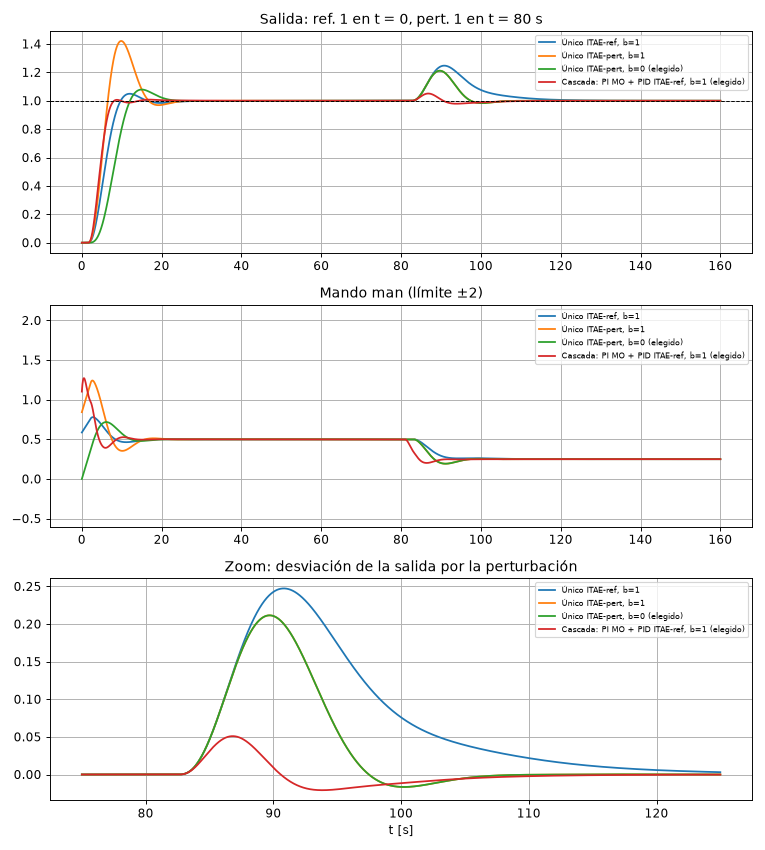
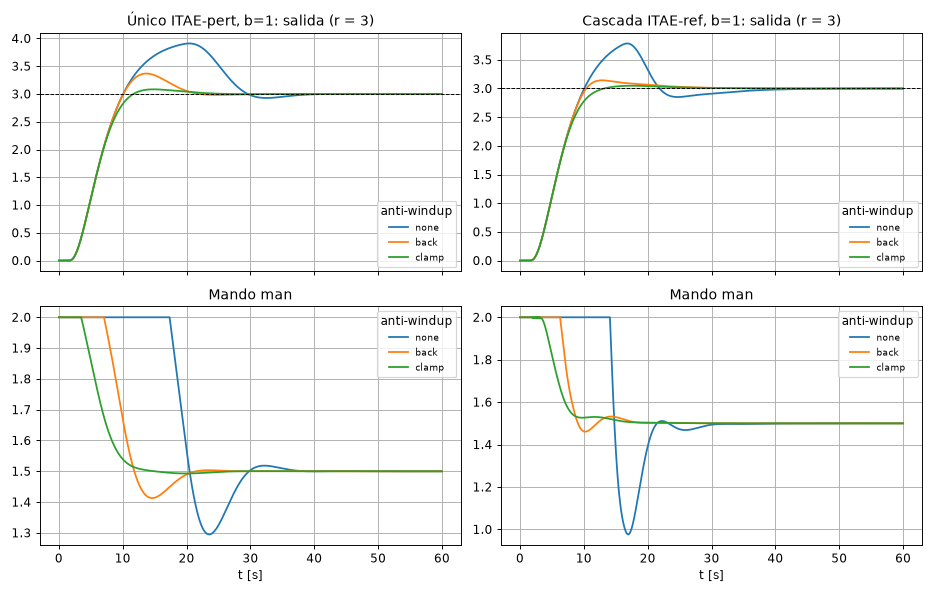

# Certamen 1 Control de Procesos 2026, resuelto

**Archivos de esta carpeta**

| Archivo | Qué es |
|---|---|
| `calculos26.m` | Identificación (Ku, Tu por la condición de fase, PORT 28 %/63 %), sintonías ZN/CC/ITAE y controlador interno por MO. Guarda `sintonias26.mat`. |
| `main26.m` | Simula todas las estrategias y los tres casos de anti-windup, imprime las tablas y grafica. |
| `simular26.m` | Simulación de la planta con retardos, saturación ±2 y PID 2DOF con anti-windup `none` / `back` / `clamp` (equivale al modelo Simulink). |
| `pid26.m`, `metricas26.m`, `reglas26.m`, `port26.m` | Funciones auxiliares. |
| `sim26.py`, `tune26.py`, `explore26.py`, `plots26.py` | Lo mismo en Python (verificación y figuras). |

**Cómo correrlo:** copia **todos** los `.m` de esta carpeta a una misma carpeta, déjala como *Current Folder* en MATLAB y ejecuta `calculos26` y después `main26`. `main26` necesita `simular26.m`, `pid26.m` y `metricas26.m`. `calculos26.m` ya trae dentro sus funciones auxiliares, pero en Octave también necesita `reglas26.m` y `port26.m` al lado. Los `.m` no usan toolboxes (todos los bloques son de 1er orden y los retardos se simulan con buffers), así que corren en MATLAB y en Octave. Se probaron en Octave y dan los mismos números que Python.

---

## 0. Enunciado y diferencia con el 2025

```
 pert ──►[ Gp = 1/(3s+2) ]──►[ e^{-1·s} ]──┐
                                            ▼+
 man ──►[ G1 = 4/(s+2) ]─────────────────►( Σ )──►[ G2 = 0.5/(2s+1) ]──┬──►[ G3 = 2/(4s+1) ]──►[ e^{-1.5·s} ]──┬──► salida
                                             +                          │                                        │
                                                                        └──► med2                                ▼
                                                    med1 ◄──[ e^{-0.5·s} ]◄──[ Gs = 10/(s+10) ]◄─────────────────┘
```

- **Iguales que en 2025:** los bloques, el límite **±2** en man, med1 disponible y med2 como sensor opcional.
- **Diferencia clave:** la perturbación entra **entre G1 y G2, antes de med2**. En 2025 entraba después de med2. Ahora queda **dentro del lazo interno** de una cascada con med2.
- **Especificaciones:**
  - error cero ante escalones unitarios en la referencia y en la perturbación;
  - sobrepaso **lo menor posible**;
  - rechazo a perturbaciones **lo más rápido posible**.
- **Pedido:** al menos una estrategia de lazo único y una de mando subordinado; compararlas con la saturación y los **dos anti-windup de Simulink** (back-calculation y clamping); elegir la más adecuada.

---

## 1. Análisis de la planta

| Camino | Ganancia | Constantes de tiempo | Retardo |
|---|---|---|---|
| man → med2 ($G_1G_2$) | 1 | 0.5 y 2 s | 0 |
| man → salida | 2 | 0.5, 2, 4 s | 1.5 s |
| man → med1 | 2 | 0.5, 2, 4, 0.1 s | **2 s** |
| pert → salida ($G_pe^{-s}G_2G_3e^{-1.5s}$) | $0.5\cdot0.5\cdot2=0.5$ | 1.5, 2, 4 s | 2.5 s |

1. **Controlador con integrador.** La planta es tipo 0 y se pide error cero también ante la perturbación, así que el integrador tiene que estar en el controlador.
2. **Mando en estado estable:** 0.5 para la referencia unitaria y −0.25 para compensar la perturbación unitaria. Ambos muy dentro de ±2. **La saturación solo aparece en transitorios**: golpe derivativo, ganancias altas o cambios grandes de referencia.
3. **Métodos aplicables.**
   - Con med1 hay **2 s de retardo**. MO y MS necesitan invertir la planta y $e^{+Ls}$ no es realizable, así que se usan reglas de sintonía sobre un PORT.
   - El lazo **man → med2 no tiene retardo**: ahí sí se usa MO.
4. **Los dos objetivos compiten.**
   - Menor sobrepaso pide una sintonía conservadora (criterio para la referencia).
   - Rechazo rápido pide una agresiva (criterio para la perturbación).
   - La herramienta para tener ambos es el **PID de 2 grados de libertad** (bloque *PID Controller (2DOF)*): el peso $b$ de la referencia en la acción P y $c=0$ (D sobre la medición) cambian **solo** la respuesta a la referencia. La respuesta a la perturbación depende solo de P, I y D.

---

## 2. Identificación y sintonías (`calculos26.m`)

**Lazo único (man → med1):**
- Condición de fase: $-\arctan0.5\omega-\arctan2\omega-\arctan4\omega-\arctan0.1\omega-2\omega=-\pi$.
- Resultado: $\omega_u=0.490$ rad/s, $K_u=1.586$, $T_u=12.83$ s.
- PORT: $K=2$, $T=4.99$ s, $L=3.97$ s, $L/T=0.795$. Fuera del rango de ZN (0.1–0.5), dentro del de los criterios integrales (hasta 1).

**Cascada, lazo interno por MO sobre med2** ($T_u=0.5$, se compensa la constante de 2 s, $K=1$):

$$G_{c1}=\frac{1}{2T_us(T_us+1)\,G_1G_2}=\frac{2s+1}{s}=2+\frac1s\qquad(P=2,\ I=1,\ K_b=1/T_i=0.5)$$

Su lazo cerrado es $\dfrac{2}{s^2+2s+2}\approx\dfrac{1}{s+1}$.

**Cascada, lazo externo** (interno cerrado · $G_3$ · $G_s$ · $e^{-2s}$):
- $K_u=1.363$, $T_u=10.15$ s.
- PORT: $K=2$, $T=3.81$ s, $L=3.26$ s, $L/T=0.856$.

| Regla (forma ideal) | Lazo único P / I / D | Externo cascada P / I / D |
|---|---|---|
| ZN ($K_u$, serie → ideal) | 1.239 / 0.154 / 1.590 | 1.065 / 0.168 / 1.080 |
| Cohen-Coon | 0.964 / 0.128 / 1.215 | 0.904 / 0.148 / 0.928 |
| ITAE referencia | 0.587 / 0.080 / 0.729 | **0.551 / 0.097 / 0.560** |
| ITAE perturbación | **0.843 / 0.169 / 1.276** | 0.786 / 0.195 / 0.978 |

En todos los casos: $N=10$ y $K_b=1/\sqrt{T_iT_d}$.

---

## 3. FT ante la perturbación: por qué la cascada gana tanto

Receta del Resumen, sección 2.6: una ecuación por bloque y despejar. Con $H=G_se^{-0.5s}$ y $G_{pd}=G_pe^{-s}$:

**Lazo único:** $man=C(r-med_1)$, $med_2=G_2(G_1\,man+G_{pd}\,d)$, $y=G_3e^{-1.5s}med_2$, $med_1=Hy$.

$$\frac{Y}{D}=\frac{G_{pd}\,G_2\,G_3e^{-1.5s}}{1+C\,G_1G_2G_3e^{-1.5s}H}$$

El controlador recién se entera de la perturbación cuando atraviesa $G_2$, $G_3$ y **2 s de retardo**.

**Cascada:** $r_2=C_2(r-med_1)$, $man=G_{c1}(r_2-med_2)$, y las mismas ecuaciones de planta. Reemplazando $man$ en $med_2$:

$$med_2\,\big[1+G_1G_2G_{c1}(1+C_2G_3e^{-1.5s}H)\big]=G_1G_2G_{c1}C_2\,r+G_2G_{pd}\,d$$

$$\frac{Y}{D}=\frac{G_{pd}\,G_2\,G_3e^{-1.5s}}{1+G_1G_2G_{c1}\,\big(1+C_2G_3e^{-1.5s}H\big)}$$

El denominador tiene el término $G_1G_2G_{c1}$, **sin retardo y sin $G_3$**. El lazo interno ve la perturbación en med2 apenas pasa por $G_2$ y la corrige con su propia rapidez (≈ 1 s), antes de que llegue a la salida.

*(En 2025 la perturbación entraba después de med2 y ese término no la afectaba: la mejora era solo del 10 %. Aquí es un factor ≈ 4. Ver sección 4.)*

---

## 4. Resultados de simulación (`main26.m`)

Condiciones: referencia 1 en t = 0, perturbación 1 en t = 80 s, man saturado a ±2, back-calculation. "Pico" y "IAE" son de la desviación de la salida por la perturbación; "recup." es el tiempo hasta quedar dentro de ±0.02.

| Estrategia | $M_p$ | $t_r$ | $t_s$ | Pico pert. | Recup. | IAE pert. | $\lvert man\rvert_{max}$ |
|---|---|---|---|---|---|---|---|
| Único, PID ITAE-ref, b = 1 | 4.9 % | 5.1 s | 14.8 s | 0.247 | 30.7 s | 3.13 | 0.78 |
| Único, PID ITAE-pert, b = 1 | 42.0 % | 3.1 s | 21.5 s | 0.211 | 16.4 s | 1.67 | 1.24 |
| **Único, PID ITAE-pert, b = 0** | **7.8 %** | 6.0 s | 20.2 s | **0.211** | **16.4 s** | **1.67** | 0.72 |
| **Cascada, PI MO + PID ITAE-ref, b = 1** | **0.8 %** | **3.7 s** | **7.5 s** | **0.051** | **14.8 s** | **0.44** | 1.27 |
| Cascada, PI MO + PID ITAE-pert, b = 0 | 4.4 % | 4.7 s | 19.8 s | 0.049 | 14.6 s | 0.38 | 0.89 |
| Cascada, PI MO + PID CC, b = 0.5 | 0.4 % | 3.9 s | 22.4 s | 0.049 | 13.7 s | 0.37 | 1.13 |



**Lectura:**

1. **Lazo único: el 2DOF resuelve el compromiso.**
   - ITAE-ref da poco sobrepaso (4.9 %) pero rechaza lento (IAE 3.13, 31 s).
   - ITAE-pert rechaza el doble de rápido (IAE 1.67, 16 s) pero sobrepasa 42 %.
   - Con $b=0$ se conserva **exactamente** el rechazo de ITAE-pert (P, I y D no cambian) y el sobrepaso baja a 7.8 %. Es el mejor lazo único para lo que se pide.
2. **Cascada: la perturbación la rechaza el lazo interno.**
   - El pico baja de 0.21 a **0.05** (4 veces menor) y el IAE de 1.67 a **0.44** (3.8 veces menor), con cualquier sintonía del externo.
   - Por eso el externo se puede sintonizar pensando solo en la referencia: **ITAE-ref con b = 1** da 0.8 % de sobrepaso y se establece en 7.5 s.
   - El externo ITAE-pert o CC mejora el IAE de perturbación apenas (0.38 vs. 0.44) a costa de una referencia más lenta.

---

## 5. Anti-windup: ninguno vs. back-calculation vs. clamping

**Con los escalones unitarios del enunciado los diseños elegidos no saturan** (man máx 0.72 y 1.27), así que el anti-windup no se activa: los tres métodos dan lo mismo. Hay que probarlo en condiciones donde el mando sí se sature:

- **Referencia de 3.** man en estado estable = 1.5, todavía alcanzable, pero el transitorio pide más de 2.
- **Sintonía agresiva** con b = 1 (el ZN en cascada satura incluso con referencia 1).

| Diseño | r | Sin AW | Back-calculation | Clamping |
|---|---|---|---|---|
| Único ITAE-pert, b = 0 | 3 | $M_p$ 9.0 %, $t_s$ 21.3 s | 6.7 %, 20.8 s | **4.5 %, 20.3 s** |
| Único ITAE-pert, b = 1 | 3 | 30.3 %, 34.2 s | 12.3 %, 19.9 s | **2.8 %, 18.1 s** |
| **Cascada ITAE-ref, b = 1** | 3 | 26.1 %, 33.2 s | 4.7 %, 20.8 s | **1.6 %, 11.7 s** |
| Cascada ZN, b = 1 | 1 | 57.1 %, 42.5 s | 51.4 %, 42.2 s | 45.5 %, 38.3 s |
| Cascada ZN, b = 1 | 3 | 31.7 %, 42.6 s | 1.7 %, 24.6 s | 0.5 %, 23.6 s ($t_r$ 10.8 s) |



**Conclusiones sobre el anti-windup:**
- **Sin anti-windup**, cuando el mando satura la integral sigue acumulando. El sobrepaso se dispara (26–32 %) y el establecimiento se alarga a más de 33 s.
- **Los dos métodos lo corrigen.** En esta planta **clamping** es algo mejor: menor sobrepaso y, en la cascada, establecimiento 11.7 s contra 20.8 s.
  - Back-calculation depende de $K_b$. Con $K_b=1/\sqrt{T_iT_d}$ descarga la integral más lento de lo necesario.
  - Clamping simplemente congela la integral mientras hay saturación, y no tiene parámetros que ajustar.
- **En la cascada**, el anti-windup tiene que ir en el **interno**, que es el que satura, y también en el externo si se limita su salida: cuando el interno satura, el externo no ve respuesta y también acumula.
- El anti-windup **no cambia** el rechazo a la perturbación unitaria, porque ahí el mando no satura (Δman = −0.25).

---

## 6. Conclusión: ¿cuál es la más adecuada?

**El mando subordinado: PI interno por MO sobre med2 + PID externo ITAE-referencia (2DOF, b = 1, c = 0), con clamping.**

1. **Rechazo a la perturbación, que es el objetivo más exigente.** La perturbación entra antes de med2, dentro del lazo interno. El PI interno, rápido y sin retardo, la corrige antes de que pase por $G_3$ y los retardos. Pico 0.05 contra 0.21 e IAE 0.44 contra 1.67: **cerca de 4 veces mejor** que el mejor lazo único. Ningún ajuste del lazo único puede lograrlo, porque su controlador solo ve la perturbación 2 s tarde (sección 3).
2. **Sobrepaso mínimo:** 0.8 %, el menor de todos. Además es la respuesta más rápida a la referencia ($t_s$ = 7.5 s), porque el interno reemplaza las constantes de 0.5 y 2 s por un lazo de ≈ 1 s.
3. **Mando:** 1.27 como máximo con referencia unitaria, dentro de ±2. Si se satura (cambios grandes de referencia), **clamping** en ambos controladores mantiene el sobrepaso bajo (1.6 % con r = 3).
4. **Costo:** instalar el sensor en med2 y un segundo controlador, que es un PI simple. Se justifica por la mejora ante la perturbación.

Si **no** se puede instalar el sensor, la mejor opción de lazo único es el **PID ITAE-perturbación en 2DOF con b = 0, c = 0 y clamping**: rechaza lo más rápido posible con un solo lazo (IAE 1.67) y mantiene el sobrepaso en 7.8 %.

---

## 7. Diagramas de Simulink

### Modelo A: lazo único (PID 2DOF sobre med1)

```
                                  [Step pert, t=80]──►[ Gp ]──►[Transport Delay 1]──┐
                                                                                     ▼+
 [Step r]──►│Ref  PID Controller (2DOF)│── man ──►[ G1 ]──────────────────────────►( Σ )──►[ G2 ]──┬──►[ G3 ]──►[Transport Delay 1.5]──┬── salida ──►[Scope]
      ┌────►│y   (límite ±2, clamping) │                                             +              └── med2 ──►[Scope]                  │
      │                                                                                                                                  │
      └── med1 ◄──[Transport Delay 0.5]◄──[ Gs ]◄────────────────────────────────────────────────────────────────────────────────────────┘
```

| Bloque | Parámetros |
|---|---|
| G1 | Transfer Fcn: Num `4`, Den `[1 2]` |
| Gp | Transfer Fcn: Num `1`, Den `[3 2]` |
| Transport Delay (pert.) | 1 |
| Σ (entre G1 y G2) | `++` |
| G2 | Transfer Fcn: Num `0.5`, Den `[2 1]` |
| G3 | Transfer Fcn: Num `2`, Den `[4 1]` |
| Transport Delay (salida) | 1.5 |
| Gs | Transfer Fcn: Num `10`, Den `[1 10]` |
| Transport Delay (sensor) | 0.5 |
| **PID Controller (2DOF)** | Form **Parallel**. **P = 0.8427, I = 0.1683, D = 1.2764, N = 10, b = 0, c = 0** |
| ↳ *Output Saturation* | Limit output ✔, Upper **2**, Lower **−2** |
| ↳ *Anti-windup method* | **clamping**. Para comparar: `none` y `back-calculation` con **Kb = 0.363** |
| Step r | Time 0, Final 1 (y 3 para la prueba de anti-windup) |
| Step pert | Time 80, Final 1 |

Entradas del bloque 2DOF: **Ref** = r, **y** = med1.

### Modelo B: mando subordinado

```
                                                                    [Step pert]──►[ Gp ]──►[Delay 1]──┐
                                                                                                       ▼+
 [Step r]──►│Ref PID externo (2DOF)│── r2 ──►│Ref PI interno│── man ──►[ G1 ]───────────────────────►( Σ )──►[ G2 ]──┬──►[ G3 ]──►[Delay 1.5]──┬── salida
      ┌────►│y   (±2, clamping)    │    ┌───►│y (±2, clamp.)│                                           +              │                          │
      │                                 └──────────────────────────────── med2 ◄─────────────────────────────────────┘                          │
      └── med1 ◄──[Delay 0.5]◄──[ Gs ]◄──────────────────────────────────────────────────────────────────────────────────────────────────────┘
```

| Bloque | Parámetros |
|---|---|
| Planta, retardos, escalones | Iguales que en el modelo A |
| **PI interno** (PID Controller, o 2DOF con b = 1) | Controller **PI**, Parallel, **P = 2, I = 1**. Limit output **±2**. Anti-windup **clamping** (o back-calculation con **Kb = 0.5**) |
| **PID externo** (PID Controller 2DOF) | Parallel, **P = 0.5512, I = 0.0968, D = 0.5605, N = 10, b = 1, c = 0**. Limit output **±2** (rango útil de med2). Anti-windup **clamping** (o back-calculation con **Kb = 0.416**) |

Entradas: externo Ref = r, y = med1. Interno Ref = r2 (salida del externo), y = **med2**. La salida del interno es man.

**Configuración:** Stop time 160 s, solver ode45 o paso fijo 0.005 s.

**Resultados esperados (r = 1):**

| Modelo | $M_p$ | $t_s$ | Pico pert. | IAE pert. |
|---|---|---|---|---|
| A | ≈ 7.8 % | ≈ 20 s | ≈ 0.21 | ≈ 1.7 |
| B | ≈ 0.8 % | ≈ 7.5 s | ≈ 0.05 | ≈ 0.44 |
